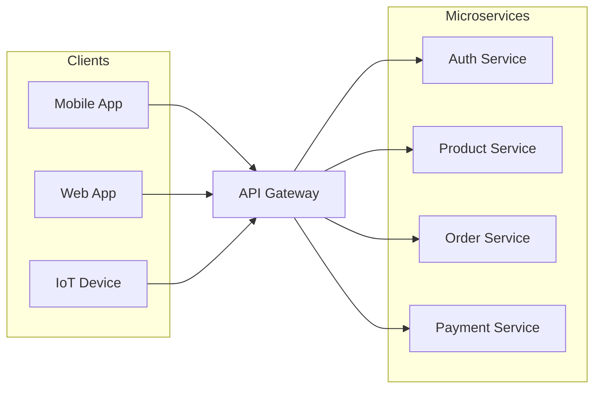
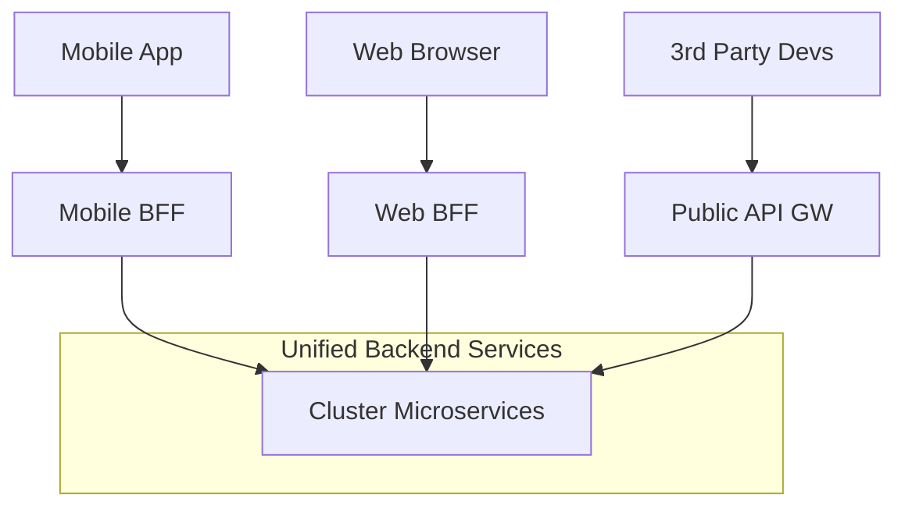

# API Gateway Là Gì? Hướng Dẫn Chi Tiết & Best Practices

> **Tóm tắt:** Tài liệu này giải thích khái niệm API Gateway, vai trò của nó trong kiến trúc Microservices, so sánh với Load Balancer/Reverse Proxy, và cập nhật các patterns & best practices mới nhất năm 2024-2025.

---

## Mục Lục
1. [Định Nghĩa API Gateway](#1-định-nghĩa-api-gateway)
2. [Tại Sao Cần API Gateway?](#2-tại-sao-cần-api-gateway)
3. [Các Chức Năng Cốt Lõi](#3-các-chức-năng-cốt-lõi)
4. [So Sánh: API Gateway vs Load Balancer vs Reverse Proxy](#4-so-sánh-api-gateway-vs-load-balancer-vs-reverse-proxy)
5. [Các Pattern Phổ Biến](#5-các-pattern-phổ-biến)
6. [Best Practices (Cập nhật 2024-2025)](#6-best-practices-cập-nhật-2024-2025)
7. [Các Công Cụ Phổ Biến](#7-các-công-cụ-phổ-biến)

---

## 1. Định Nghĩa API Gateway

**API Gateway** là một thành phần nằm giữa client (người dùng cuối, ứng dụng mobile, web app) và các backend services (microservices). Nó đóng vai trò là "cổng vào duy nhất" (single entry point) cho tất cả các yêu cầu từ client đến hệ thống.

Thay vì client phải gọi trực tiếp đến hàng chục microservice khác nhau, client chỉ cần gọi đến API Gateway, và Gateway sẽ định tuyến (route) yêu cầu đó đến đúng service cần thiết.

---

## 2. Tại Sao Cần API Gateway?

Nếu không có API Gateway, client sẽ gặp phải các vấn đề sau (Direct Client-to-Microservice Communication):

1.  **Phức tạp cho Client:** Client phải nhớ địa chỉ (endpoint) của từng service.
2.  **Bảo mật kém:** Tất cả microservices phải public ra internet và tự xử lý authentication/SSL.
3.  **Coupling chặt chẽ:** Nếu backend thay đổi cấu trúc chia nhỏ service, client cũng phải sửa code theo.
4.  **Network Latency:** Một thao tác trên UI có thể cần gọi 5-6 services, gây ra nhiều round-trip qua mạng internet chậm chạp.

**Giải pháp của API Gateway:**
*   Ẩn cấu trúc bên trong của hệ thống.
*   Giảm số lượng request từ client nhờ cơ chế Aggregation (gộp response).
*   Chuyển các mối lo ngại chung (Cross-cutting concerns) như Auth, Logging về một nơi duy nhất.

---

## 3. Các Chức Năng Cốt Lõi

Một API Gateway hiện đại thường đảm nhận các nhiệm vụ sau (còn gọi là **Gateway Offloading**):

### 3.1. Routing & Load Balancing (Layer 7)
Định tuyến request dựa trên đường dẫn (path), headers, hoặc parameters.
*   `/api/products` -> Product Service
*   `/api/orders` -> Order Service

### 3.2. Authentication & Authorization
Xác thực người dùng (verify JWT, OAuth2) tại Gateway trước khi request đi vào bên trong. Giúp backend services tập trung vào business logic.

### 3.3. Rate Limiting & Throttling
Bảo vệ hệ thống khỏi bị quá tải hoặc tấn công DDoS bằng cách giới hạn số lượng request từ một user/IP trong một khoảng thời gian.

### 3.4. Protocol Translation
Chuyển đổi giao thức để client dễ dàng giao tiếp.
*   Client dùng **HTTP/REST**.
*   Gateway chuyển đổi sang **gRPC** hoặc **AMQP** để gọi backend.

### 3.5. Response Aggregation
Gộp kết quả từ nhiều service thành một response duy nhất trả về cho client.
*   *Ví dụ:* Route `/product-details` gọi song song Product Service, Pricing Service, và Inventory Service rồi gộp lại JSON.

---

## 4. So Sánh: API Gateway vs Load Balancer vs Reverse Proxy

Rất dễ nhầm lẫn giữa 3 khái niệm này. Dưới đây là sự khác biệt chính:

| Tiêu chí | Load Balancer (LB) | Reverse Proxy | API Gateway |
| :--- | :--- | :--- | :--- |
| **Mục đích chính** | Phân phối tải để đảm bảo availability & scale | Bảo mật, ẩn danh server, caching cơ bản | Quản lý API, orchestration, business-aware routing |
| **OSI Layer** | Layer 4 (Transport) & Layer 7 (App) | Layer 7 (Application) | Layer 7 (Application) |
| **Hiểu biết về API** | Thấp (Chỉ biết IP/Port hoặc URL cơ bản) | Trung bình | Cao (Hiểu rõ resource, method, data structure) |
| **Tính năng** | Health check, Algo phân tải (Round Robin...) | SSL Termination, Compression, Caching | **Aggregation, Auth, Rate Limit, Transformation** |

> **Tóm lại:** API Gateway là một Reverse Proxy "thông minh" và chuyên dụng cho API, thường bao gồm cả chức năng Load Balancing.

---

## 5. Các Pattern Phổ Biến

### 5.1. Backend for Frontend (BFF)
Thay vì dùng 1 Github Gateway khổng lồ cho tất cả client, ta tạo ra các Gateway riêng biệt cho từng loại client để tối ưu trải nghiệm.

*   **Mobile BFF:** Trả về ít dữ liệu hơn, format nhỏ gọn.
*   **Web BFF:** Trả về nhiều dữ liệu hơn cho màn hình lớn.

### 5.2. Gateway Offloading pattern
Di chuyển các chức năng chung (SSL termination, Auth, IP Whitelisting, Logging) từ từng service ra Gateway để giảm tải cho team phát triển service.

---

## 6. Best Practices (Cập nhật 2024-2025)

1.  **Zero Trust Security:** Đừng chỉ dựa hoàn toàn vào Gateway.
    *   Gateway xác thực Token (Edge Auth).
    *   Nhưng Service bên trong BẮT BUỘC vẫn phải validate token (Defense in Depth) để tránh tấn công từ nội bộ (lateral movement).
2.  **Không chứa Business Logic:** Gateway chỉ nên làm nhiệm vụ routing và cross-cutting concerns. Đừng viết code xử lý nghiệp vụ phức tạp tại đây (sẽ biến thành "Distributed Monolith").
3.  **Observability:** Gateway là nơi tuyệt vời để đo lường metrics:
    *   Latency (độ trễ) toàn hệ thống.
    *   Error rates (4xx, 5xx).
    *   Traffic volume.
4.  **Resiliency (Khả năng phục hồi):** Áp dụng **Circuit Breaker** và **Timeout** ngay tại Gateway. Nếu Backend Service chết, Gateway nên trả về lỗi ngay lập tức hoặc dữ liệu cache thay vì treo request của user.
5.  **Performance Optimization:** Bật **Compression (Gzip/Brotli)** và **CDN Caching** tại lớp Gateway cho các static response.

---

## 7. Các Công Cụ Phổ Biến

### Open Source & Self-hosted
*   **Kong Gateway:** Phổ biến nhất, dựa trên Nginx + Lua. Mạnh mẽ, nhiều plugins.
*   **NGINX:** Reverse Proxy huyền thoại, thường được config làm Gateway đơn giản.
*   **Apache APISIX:** Cloud-native, high performance, dynamic configuration (hot-reload tốt).
*   **Traefik:** Rất phổ biến trong môi trường Docker/Kubernetes, auto-discovery service cực tốt.

### Cloud Providers (Managed Services)
*   **AWS API Gateway:** Serverless, tích hợp sâu với AWS Lambda.
*   **Google Cloud Endpoints / Apigee:** Giải pháp enterprise mạnh mẽ của Google.
*   **Azure API Management.**

---

> **Kết luận:** API Gateway là thành phần không thể thiếu trong kiến trúc Microservices hiện đại. Nó đơn giản hóa việc giao tiếp cho client và giúp backend an toàn, dễ quản lý hơn. Tuy nhiên, cần tránh biến nó thành nút thắt cổ chai (bottleneck) bằng cách không nhồi nhét business logic vào gateway.
