# Netflix Event-Driven Architecture - Phân Tích Chi Tiết

## Mục Lục

1. [Tổng Quan](#1-tổng-quan)
2. [Các Thành Phần Chính](#2-các-thành-phần-chính)
3. [Keystone Pipeline](#3-keystone-pipeline)
4. [Real-Time Distributed Graph (RDG)](#4-real-time-distributed-graph-rdg)
5. [Kafka - Backbone của Event Streaming](#5-kafka---backbone-của-event-streaming)
6. [Apache Flink - Real-Time Processing](#6-apache-flink---real-time-processing)
7. [Ads Event Processing Pipeline](#7-ads-event-processing-pipeline)
8. [Best Practices và Lessons Learned](#8-best-practices-và-lessons-learned)
9. [So Sánh với Các Giải Pháp Khác](#9-so-sánh-với-các-giải-pháp-khác)
10. [Kết Luận](#10-kết-luận)

---

## 1. Tổng Quan

### 1.1 Event-Driven Architecture là gì?

**Event-Driven Architecture (EDA)** là một mô hình kiến trúc phần mềm trong đó các thành phần giao tiếp với nhau thông qua việc tạo ra, phát hiện và xử lý các **events** (sự kiện). Thay vì gọi trực tiếp các service khác (synchronous), các service sẽ phát ra events và các service quan tâm sẽ lắng nghe và phản ứng với những events đó (asynchronous).

### 1.2 Tại sao Netflix chọn Event-Driven Architecture?

Netflix xử lý một khối lượng dữ liệu khổng lồ với:

| Thống Kê | Số Liệu |
|----------|---------|
| Subscribers | 260+ triệu người dùng |
| Giờ xem trung bình/ngày | 3.2 giờ/người |
| Events xử lý | Hàng chục triệu events/giây |
| Phim và series | 5,000+ phim, 50,000+ tập |

**Lý do chính:**

- **Scalability**: Xử lý hàng triệu events/giây
- **Decoupling**: Các microservices độc lập, dễ triển khai
- **Resilience**: Hệ thống chịu lỗi tốt hơn
- **Real-time Processing**: Phân tích và phản hồi real-time
- **Flexibility**: Dễ dàng thêm consumers mới

### 1.3 Kiến Trúc Tổng Quan

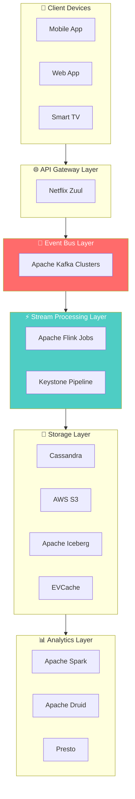

---

## 2. Các Thành Phần Chính

### 2.1 Event Producers (Nguồn phát sinh Events)

Events trong Netflix được sinh ra từ nhiều nguồn khác nhau:

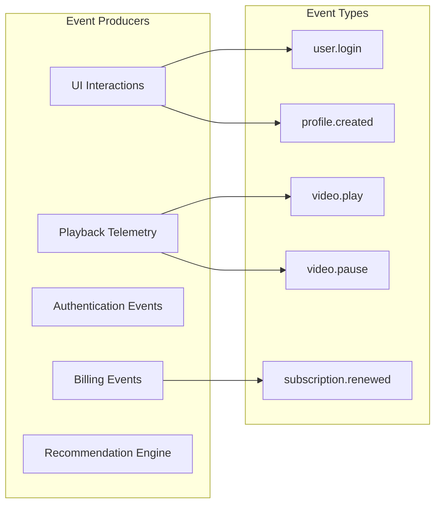

**Ví dụ Event Flow:**
1. User đăng nhập vào Netflix app
2. Action được gửi đến API Gateway
3. Gateway publish event `user.logged_in` vào Kafka
4. Các downstream services consume event này

### 2.2 Event Schema

Netflix sử dụng một schema chuẩn cho events:

```json
{
  "event_id": "uuid-v4",
  "event_type": "video.play.started",
  "timestamp": "2024-12-26T12:00:00Z",
  "version": "1.0",
  "source": {
    "service": "playback-service",
    "device_type": "smart_tv",
    "region": "us-east-1"
  },
  "payload": {
    "user_id": "user-123",
    "video_id": "stranger-things-s4e01",
    "profile_id": "profile-456",
    "quality": "4K",
    "position_ms": 0
  },
  "metadata": {
    "trace_id": "trace-789",
    "correlation_id": "corr-101"
  }
}
```

### 2.3 Event Categories

| Category | Ví dụ Events | Volume |
|----------|--------------|--------|
| **Playback Events** | play, pause, seek, stop | Rất cao |
| **User Events** | login, logout, profile_switch | Cao |
| **Billing Events** | subscription_created, payment_processed | Trung bình |
| **Content Events** | content_added, metadata_updated | Thấp |
| **System Events** | health_check, error_logged | Cao |

---

## 3. Keystone Pipeline

### 3.1 Tổng Quan Keystone

**Keystone Pipeline** là hạ tầng thống nhất của Netflix cho việc publishing, collecting, và routing events. Đây là một trong những thành phần quan trọng nhất trong EDA của Netflix.

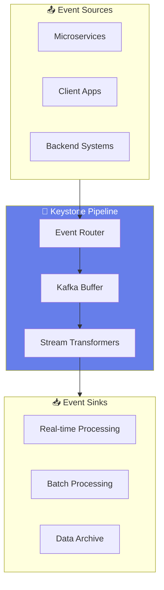

### 3.2 Kiến Trúc Keystone Chi Tiết

**Các thành phần:**

1. **Event Publisher SDK**
   - Cung cấp cho các service để publish events
   - Hỗ trợ batching và compression
   - Automatic retry với exponential backoff

2. **Kafka Clusters**
   - Multiple clusters cho high availability
   - Topic-based routing
   - Multi-region replication

3. **Router Service**
   - Rule-based routing
   - Content-based filtering
   - Dynamic topology

4. **Stream Processors**
   - Flink jobs cho real-time processing
   - Spark jobs cho batch processing

### 3.3 Data Flow trong Keystone

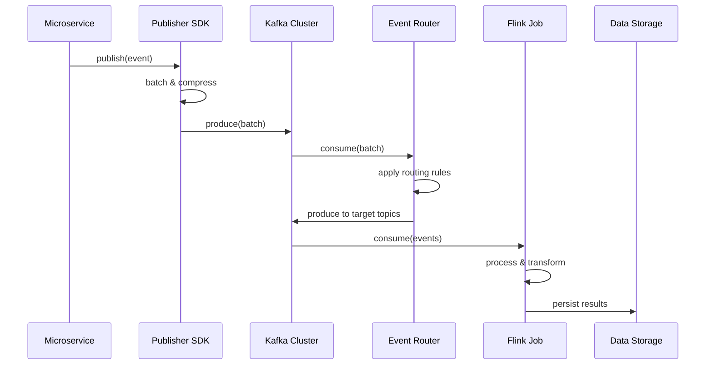

### 3.4 Giải Thích Chi Tiết Data Flow trong Keystone

Data flow trong Keystone được chia thành **3 phases chính**, mỗi phase có nhiệm vụ và đặc điểm riêng:

#### 📤 **Phase 1: Event Publishing (Producer Side)**

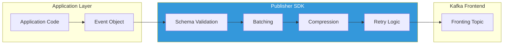

**Bước 1: Service gọi `publish(event)` thông qua SDK**

```java
// Ví dụ: Playback service publish event khi user bắt đầu xem video
KeystoneEvent event = KeystoneEvent.builder()
    .eventType("video.play.started")
    .userId("user-123")
    .videoId("stranger-things-s4e01")
    .timestamp(Instant.now())
    .deviceInfo(deviceInfo)
    .build();

keystonePublisher.publish(event);
```

| Thao tác | Mô tả chi tiết |
|----------|----------------|
| **Create Event** | Service tạo event object với đầy đủ fields theo schema |
| **Call SDK** | SDK nhận event thông qua `publish()` method |
| **Validate** | SDK validate event against registered Avro/Protobuf schema |

**Bước 2: SDK thực hiện Batching & Compression**

```
┌─────────────────────────────────────────────────────────────┐
│                    Publisher SDK Processing                  │
├─────────────────────────────────────────────────────────────┤
│                                                              │
│  Event 1 ──┐                                                │
│  Event 2 ──┼──▶ [Batch Buffer] ──▶ [LZ4 Compress] ──▶ Kafka │
│  Event 3 ──┘         ↑                                      │
│                      │                                       │
│              Flush triggers:                                 │
│              • Buffer full (1000 events)                    │
│              • Timeout (100ms)                              │
│              • Manual flush                                  │
│                                                              │
└─────────────────────────────────────────────────────────────┘
```

| Kỹ thuật | Chi tiết | Lợi ích |
|----------|----------|---------|
| **Batching** | Gom nhiều events thành 1 batch (max 1000 events hoặc 100ms) | Giảm network overhead, tăng throughput |
| **Compression** | Sử dụng LZ4 compression algorithm | Giảm 60-70% kích thước, tối ưu bandwidth |
| **Async I/O** | Non-blocking writes với internal queue | Không block application thread |

**Bước 3: SDK produce batch vào Kafka**

```java
// Internal SDK logic (simplified)
public class KeystoneProducer {
    private final BlockingQueue<Event> buffer;
    private final KafkaProducer<String, byte[]> producer;
    
    public void publish(Event event) {
        // Add to buffer (non-blocking)
        buffer.offer(event);
    }
    
    // Background thread
    private void flushBuffer() {
        List<Event> batch = drainBuffer();
        byte[] compressed = compress(serialize(batch));
        
        ProducerRecord<String, byte[]> record = new ProducerRecord<>(
            "keystone-fronting-topic",
            event.getUserId(),  // Partition key
            compressed
        );
        
        producer.send(record, (metadata, exception) -> {
            if (exception != null) {
                retryWithBackoff(batch);
            }
        });
    }
}
```

**Error Handling trong Phase 1:**

| Error Type | Handling Strategy |
|------------|-------------------|
| Schema validation failed | Reject event, log error, increment metric |
| Kafka unavailable | Retry với exponential backoff (1s, 2s, 4s...) |
| Buffer overflow | Apply backpressure, block producer temporarily |
| Network timeout | Retry up to 3 times, then send to DLQ |

---

#### 📨 **Phase 2: Routing & Distribution (Keystone Core)**

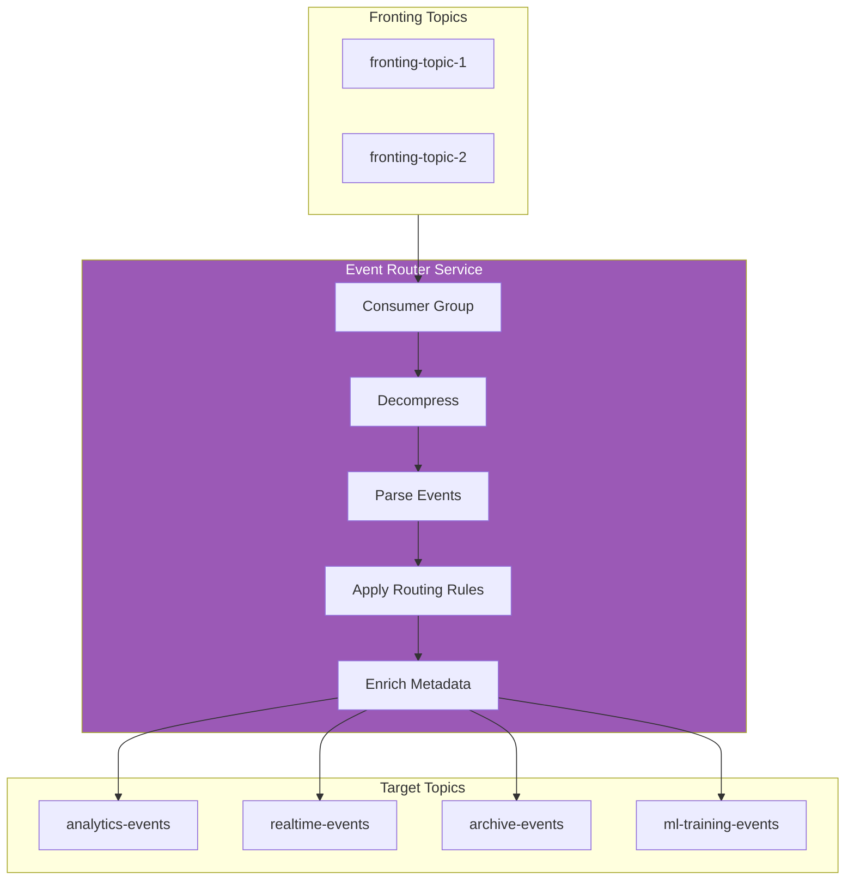

**Bước 4: Router consume từ Kafka Fronting Topics**

Router Service là một cluster của các Flink/custom Java applications chạy như consumer group:

```yaml
# Router Configuration
router:
  consumer:
    group-id: "keystone-router"
    topics:
      - "keystone-fronting-*"  # Wildcard pattern
    parallelism: 100           # 100 consumer instances
    poll-timeout: 100ms
    
  processing:
    decompression: LZ4
    deserialization: AVRO
    max-batch-size: 5000
```

**Bước 5: Apply Routing Rules**

Routing rules được định nghĩa bằng DSL và stored trong configuration service:

```yaml
# Routing Rules Configuration
routing-rules:
  - name: "playback-to-analytics"
    condition:
      event-type: "video.play.*"
    destinations:
      - topic: "analytics-playback-events"
        priority: HIGH
      - topic: "ml-recommendation-input"
        priority: NORMAL
        
  - name: "billing-events"
    condition:
      event-type: "billing.*"
      region: "us-*"
    destinations:
      - topic: "billing-events-us"
        transform:
          - mask-pii-fields
          
  - name: "all-events-archive"
    condition: "*"  # Match all
    destinations:
      - topic: "archive-all-events"
        priority: LOW
```

**Routing Decision Flow:**

```
┌────────────────────────────────────────────────────────────────┐
│                    Routing Decision Engine                      │
├────────────────────────────────────────────────────────────────┤
│                                                                 │
│  Input Event                                                    │
│       │                                                         │
│       ▼                                                         │
│  ┌─────────────────┐                                           │
│  │ Match Conditions │◀─── Event Type, Region, User Segment     │
│  └────────┬────────┘                                           │
│           │                                                     │
│           ▼                                                     │
│  ┌─────────────────┐                                           │
│  │ Resolve Topics  │◀─── Static or Dynamic topic resolution    │
│  └────────┬────────┘                                           │
│           │                                                     │
│           ▼                                                     │
│  ┌─────────────────┐                                           │
│  │ Apply Transform │◀─── PII masking, enrichment, filtering   │
│  └────────┬────────┘                                           │
│           │                                                     │
│           ▼                                                     │
│  ┌─────────────────┐                                           │
│  │ Fan-out to N    │◀─── One event → Multiple destinations    │
│  │ Destinations    │                                           │
│  └─────────────────┘                                           │
│                                                                 │
└────────────────────────────────────────────────────────────────┘
```

**Bước 6: Produce to Target Topics**

| Destination Type | Kafka Cluster | Retention | Use Case |
|------------------|---------------|-----------|----------|
| **Real-time topics** | Hot Cluster | 2 hours | Flink streaming jobs |
| **Analytics topics** | Warm Cluster | 7 days | Spark batch jobs |
| **Archive topics** | Cold Cluster | 30 days | S3 archival |
| **ML topics** | ML Cluster | 14 days | Model training |

---

#### ⚡ **Phase 3: Processing & Delivery (Consumer Side)**

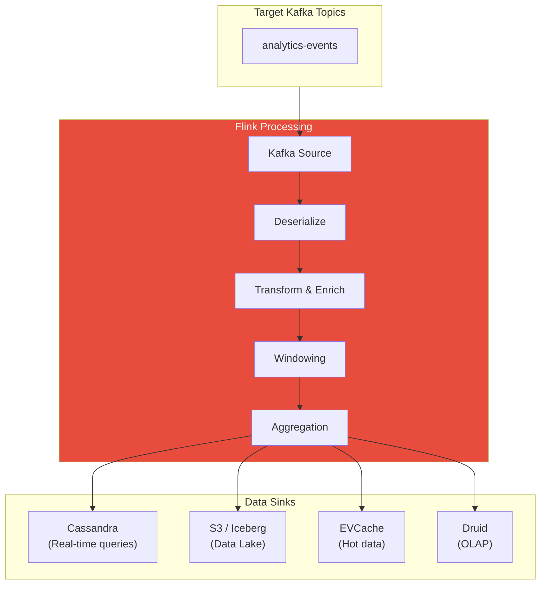

**Bước 7 & 8: Flink consume và process events**

```java
// Flink Job Example: User Activity Aggregation
public class UserActivityAggregationJob {
    
    public static void main(String[] args) throws Exception {
        StreamExecutionEnvironment env = 
            StreamExecutionEnvironment.getExecutionEnvironment();
        
        // Configure checkpointing for exactly-once
        env.enableCheckpointing(60000); // Every 1 minute
        env.setStateBackend(new RocksDBStateBackend("s3://checkpoints/"));
        
        // Step 7: Consume from Kafka
        KafkaSource<PlaybackEvent> source = KafkaSource
            .<PlaybackEvent>builder()
            .setBootstrapServers("kafka-cluster:9092")
            .setTopics("analytics-playback-events")
            .setGroupId("user-activity-aggregation")
            .setStartingOffsets(OffsetsInitializer.committedOffsets())
            .setDeserializer(new PlaybackEventDeserializer())
            .build();
        
        DataStream<PlaybackEvent> events = env.fromSource(
            source, 
            WatermarkStrategy.forBoundedOutOfOrderness(Duration.ofSeconds(5)),
            "Playback Events"
        );
        
        // Step 8: Process & Transform
        DataStream<UserActivityStats> stats = events
            // Filter valid events
            .filter(e -> e.getUserId() != null && e.getVideoId() != null)
            // Key by user
            .keyBy(PlaybackEvent::getUserId)
            // 5-minute tumbling windows
            .window(TumblingEventTimeWindows.of(Time.minutes(5)))
            // Aggregate stats
            .aggregate(new UserActivityAggregator());
        
        // Step 9: Write to multiple sinks
        stats.addSink(new CassandraSink<>()); // Real-time queries
        stats.addSink(new IcebergSink<>());   // Data lake
        
        env.execute("User Activity Aggregation");
    }
}
```

**Bước 9: Persist Results**

| Storage | Data Type | Access Pattern | Latency |
|---------|-----------|----------------|---------|
| **EVCache** | Hot aggregates (last 1 hour) | Key-value lookup | < 1ms |
| **Cassandra** | User activity history | Time-series queries | < 10ms |
| **Iceberg/S3** | Raw events + aggregates | Batch analytics | Minutes |
| **Druid** | OLAP cubes | Interactive dashboards | < 1s |

---

### 3.5 End-to-End Example: User xem Stranger Things

Để hiểu rõ hơn về data flow, hãy xem một ví dụ cụ thể:

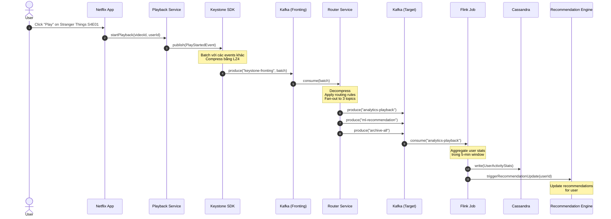

**Timeline của Event:**

| Time | Component | Action | Latency |
|------|-----------|--------|---------|
| T+0ms | Netflix App | User clicks Play | - |
| T+5ms | Playback Service | Calls SDK.publish() | 5ms |
| T+10ms | SDK | Adds to batch buffer | 5ms |
| T+100ms | SDK | Flushes batch to Kafka | 90ms (batch timeout) |
| T+150ms | Kafka Fronting | Acknowledges write | 50ms |
| T+200ms | Router | Consumes and routes | 50ms |
| T+250ms | Kafka Target | Events in target topics | 50ms |
| T+300ms | Flink | Consumes event | 50ms |
| T+5min | Flink | Window closes, aggregates | ~5 min (window) |
| T+5min+100ms | Cassandra | Stats persisted | 100ms |

**Tổng end-to-end latency**: ~300ms cho event available trong target topic, ~5 phút cho aggregated stats.

---

### 3.6 Error Handling và Recovery trong Keystone

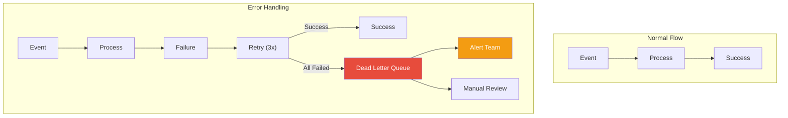

| Error Scenario | Detection | Recovery |
|----------------|-----------|----------|
| **Schema mismatch** | SDK validation | Reject + log + alert |
| **Kafka unavailable** | Connection timeout | Retry with backoff |
| **Router crash** | Health check failure | Auto-restart + rebalance |
| **Flink job failure** | Checkpoint failure | Restore from checkpoint |
| **Poison message** | Processing exception | Send to DLQ |

---

## 4. Real-Time Distributed Graph (RDG)

### 4.1 Tại sao cần RDG?

Netflix cần theo dõi và phân tích hành vi người dùng theo thời gian thực để:
- Cung cấp recommendations chính xác
- Phát hiện fraud và anomalies
- Cải thiện trải nghiệm người dùng

### 4.2 Kiến Trúc RDG

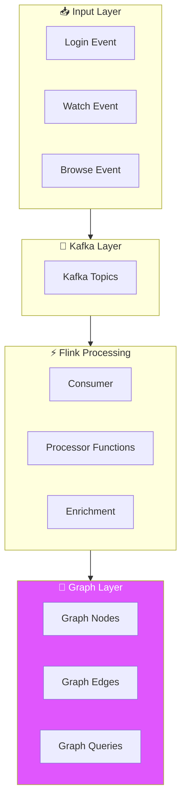

### 4.3 Anatomy của một RDG Flink Job

**Ví dụ flow khi user xem Stranger Things:**

```
1. User login vào Netflix app
2. User bắt đầu xem Stranger Things S4E01
3. Events được write vào Kafka topics
4. Flink job consume events
5. Processor functions:
   - Parse và validate event
   - Enrich với metadata
   - Update graph relationships
   - Emit processed events
```

**Các Processor Functions:**

| Function | Mô tả |
|----------|-------|
| **EventParser** | Parse raw events từ Kafka |
| **EventValidator** | Validate schema và data integrity |
| **EventEnricher** | Thêm context và metadata |
| **GraphUpdater** | Update nodes và edges trong graph |
| **EventEmitter** | Emit processed events downstream |

### 4.4 Graph Data Model

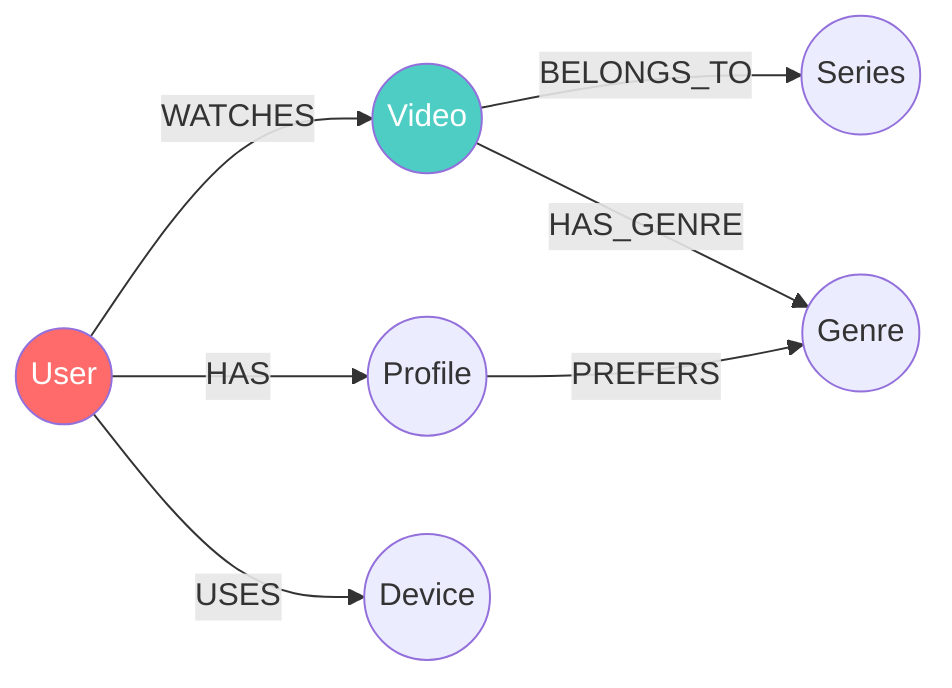

---

## 5. Kafka - Backbone của Event Streaming

### 5.1 Netflix và Kafka

Netflix sử dụng **Apache Kafka** làm backbone cho toàn bộ event streaming infrastructure. Các đặc điểm chính:

- **High Throughput**: Xử lý hàng triệu messages/giây
- **Durability**: Dữ liệu được replicate across brokers
- **Scalability**: Dễ dàng scale horizontally
- **Replayability**: Có thể replay events cho debugging

### 5.2 Kafka Architecture tại Netflix

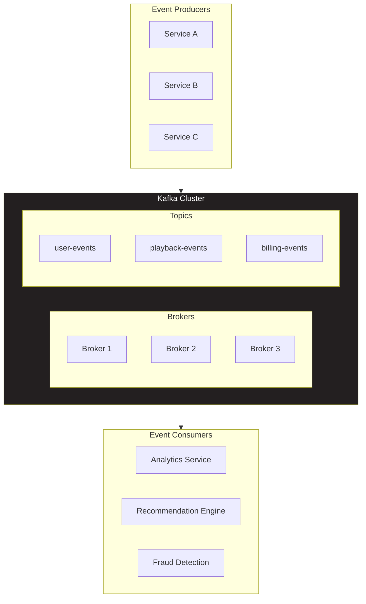

### 5.3 Topic Design Patterns

| Pattern | Use Case | Ví dụ |
|---------|----------|-------|
| **Domain-based** | Events theo business domain | `billing.events`, `playback.events` |
| **Action-based** | Events theo action type | `user.created`, `video.played` |
| **Region-based** | Events theo geographic region | `events.us-east`, `events.eu-west` |

### 5.4 Kafka Best Practices tại Netflix

1. **Partitioning Strategy**
   - Partition by user_id cho user-related events
   - Ensures ordering per user
   
2. **Retention Policies**
   - Hot data: 7 days retention
   - Cold data: Archive to S3
   
3. **Replication**
   - Minimum replication factor: 3
   - ISR (In-Sync Replicas) >= 2

4. **Compression**
   - Sử dụng LZ4 cho balance giữa speed và compression ratio

---

## 6. Apache Flink - Real-Time Processing

### 6.1 Tại sao Flink?

Netflix chọn **Apache Flink** cho real-time processing vì:

- **True Streaming**: Không phải micro-batching như Spark Streaming
- **Exactly-once Semantics**: Đảm bảo mỗi event được xử lý đúng 1 lần
- **Low Latency**: Xử lý events trong milliseconds
- **Stateful Processing**: Quản lý state hiệu quả
- **Strong Internal Support**: Netflix có platform support tốt cho Flink

### 6.2 Flink Job Architecture

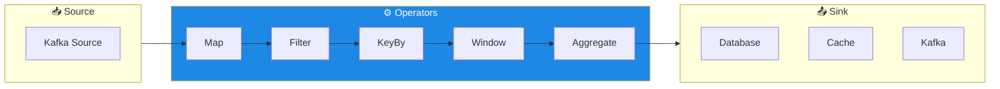

### 6.3 Ví dụ Flink Job - User Activity Tracking

```java
// Pseudo-code minh họa Flink job
public class UserActivityJob {
    
    public static void main(String[] args) throws Exception {
        StreamExecutionEnvironment env = 
            StreamExecutionEnvironment.getExecutionEnvironment();
        
        // 1. Source: Consume từ Kafka
        DataStream<Event> events = env
            .addSource(new FlinkKafkaConsumer<>(
                "user-events",
                new EventSchema(),
                kafkaProps
            ));
        
        // 2. Process: Transform và enrich
        DataStream<EnrichedEvent> enrichedEvents = events
            .filter(e -> e.getType().equals("video.play"))
            .keyBy(Event::getUserId)
            .process(new UserEnrichmentFunction());
        
        // 3. Window: Aggregate theo thời gian
        DataStream<UserStats> stats = enrichedEvents
            .keyBy(EnrichedEvent::getUserId)
            .window(TumblingEventTimeWindows.of(Time.minutes(5)))
            .aggregate(new UserStatsAggregator());
        
        // 4. Sink: Write kết quả
        stats.addSink(new CassandraSink<>());
        
        env.execute("User Activity Tracking");
    }
}
```

### 6.4 State Management

Netflix sử dụng Flink's stateful processing để:

- Track user sessions
- Maintain running aggregates
- Implement complex event processing

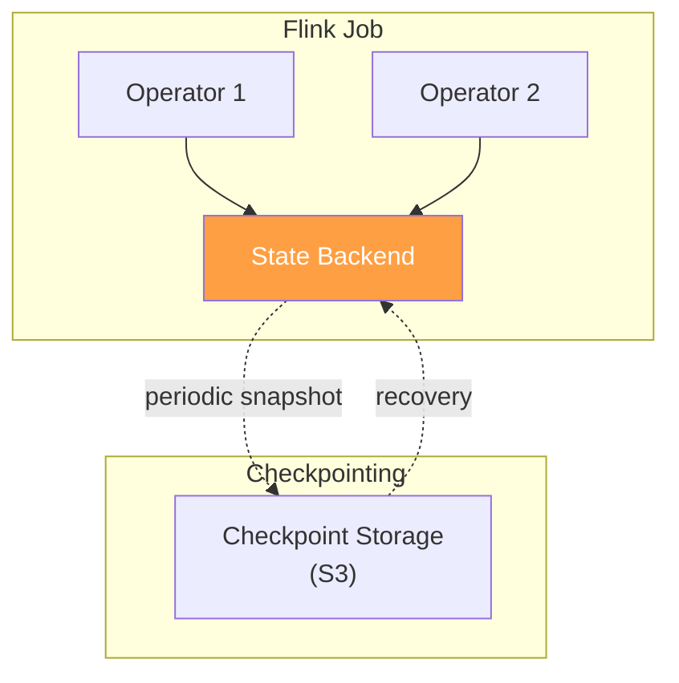

---

## 7. Ads Event Processing Pipeline

### 7.1 Tổng Quan

Với việc Netflix triển khai tier có quảng cáo, họ đã xây dựng một **Ads Event Processing Pipeline** chuyên biệt.

### 7.2 Kiến Trúc Pipeline

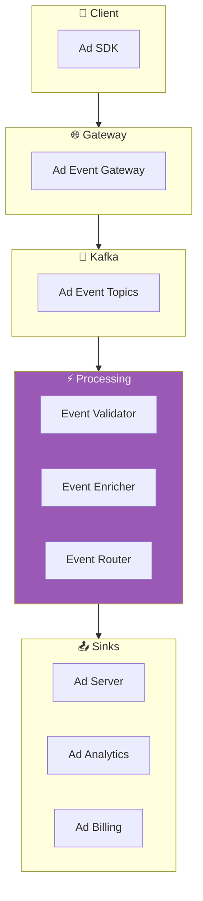

### 7.3 Ad Event Types

| Event Type | Mô tả | Latency Requirement |
|------------|-------|---------------------|
| `ad.impression` | Quảng cáo được hiển thị | < 100ms |
| `ad.click` | User click vào quảng cáo | < 50ms |
| `ad.complete` | Quảng cáo xem hết | < 200ms |
| `ad.skip` | User skip quảng cáo | < 100ms |

### 7.4 Xử Lý Real-time

Pipeline đảm bảo:
- **Low Latency**: Events được xử lý trong < 1 giây
- **Exactly-once Delivery**: Mỗi ad impression được count chính xác 1 lần
- **Fraud Detection**: Phát hiện click fraud real-time

---

## 8. Best Practices và Lessons Learned

### 8.1 Event Design Principles

1. **Events nên Immutable**
   - Một khi event được publish, không thể thay đổi
   - Sử dụng versioning cho schema changes

2. **Include Enough Context**
   - Event nên self-contained
   - Tránh việc consumer phải lookup thêm data

3. **Use Standard Schemas**
   - Avro hoặc Protobuf cho serialization
   - Schema Registry cho version management

### 8.2 Scalability Patterns

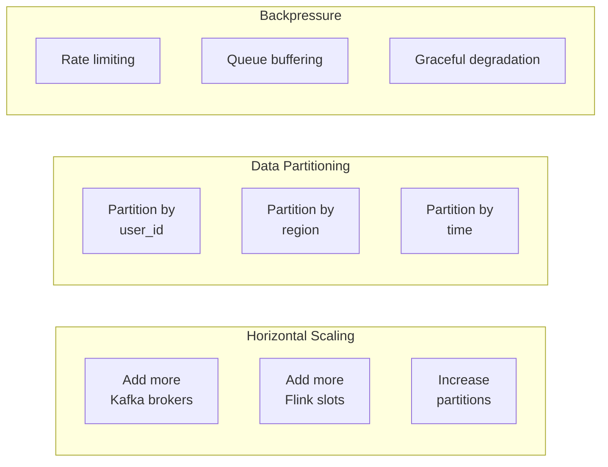

### 8.3 Reliability Patterns

| Pattern | Mô tả | Implementation |
|---------|-------|----------------|
| **Retry with Backoff** | Retry failed operations | Exponential backoff (1s, 2s, 4s, 8s...) |
| **Dead Letter Queue** | Handle poison messages | Separate topic cho failed events |
| **Circuit Breaker** | Prevent cascade failures | Hystrix (đã deprecated) → Resilience4j |
| **Idempotency** | Handle duplicate events | Event ID deduplication |

### 8.4 Monitoring và Observability

Netflix sử dụng:

- **Atlas**: Time-series metrics database (Netflix OSS)
- **Mantis**: Real-time stream processing cho alerting
- **Spectator**: Client library cho metrics collection

**Key Metrics:**

| Metric | Mô tả | Alert Threshold |
|--------|-------|-----------------|
| Event Lag | Độ trễ giữa produce và consume | > 5 phút |
| Processing Latency | Thời gian xử lý 1 event | P99 > 1s |
| Error Rate | % events failed | > 0.1% |
| Throughput | Events/second | < expected baseline |

---

## 9. So Sánh với Các Giải Pháp Khác

### 9.1 Netflix vs. Uber

| Aspect | Netflix | Uber |
|--------|---------|------|
| Primary Use Case | Content streaming & recommendations | Real-time ride matching |
| Message Broker | Kafka | Kafka + Pub/Sub |
| Processing Engine | Flink | Flink + Samza |
| Scale | ~10M events/sec | ~100M events/sec |

### 9.2 Netflix vs. LinkedIn

| Aspect | Netflix | LinkedIn |
|--------|---------|----------|
| Kafka Role | Event streaming | Event + Log aggregation |
| Custom Components | Keystone, Mantis | Brooklin, Gobblin |
| Data Lake | S3 + Iceberg | HDFS + Pinot |

### 9.3 EDA vs. Traditional Architecture

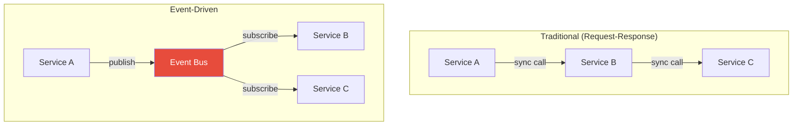

| Aspect | Traditional | Event-Driven |
|--------|-------------|--------------|
| Coupling | Tight | Loose |
| Scalability | Limited | High |
| Latency | Lower (sync) | Higher (async) |
| Complexity | Lower | Higher |
| Debugging | Easier | More challenging |

---

## 10. Kết Luận

### 10.1 Key Takeaways

1. **Kafka là trái tim của Netflix EDA** - Tất cả events flow qua Kafka
2. **Flink cho real-time processing** - Xử lý events với latency thấp
3. **Keystone unifies everything** - Cung cấp abstraction layer cho event publishing
4. **Schema evolution quan trọng** - Sử dụng versioned schemas
5. **Monitoring là critical** - Không thể manage cái gì không đo được

### 10.2 Khi nào nên áp dụng EDA?

✅ **Nên dùng khi:**
- Hệ thống cần scale lớn
- Cần real-time processing
- Nhiều consumers cho cùng một event
- Cần audit trail

❌ **Không nên dùng khi:**
- Hệ thống đơn giản
- Cần response đồng bộ
- Team chưa có experience với EDA
- Infrastructure hạn chế

### 10.3 Learning Path

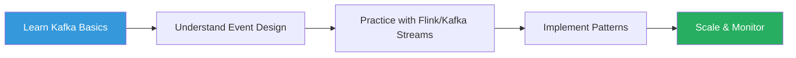

---

## Tham Khảo

1. [Netflix Tech Blog - How and Why Netflix Built a Real-Time Distributed Graph](https://netflixtechblog.com/how-and-why-netflix-built-a-real-time-distributed-graph-part-1-ingesting-and-processing-data-80113e124acc)
2. [Netflix Tech Blog - Kafka Inside Keystone Pipeline](https://netflixtechblog.com/kafka-inside-keystone-pipeline-dd5aeabaf6bb)
3. [Netflix Tech Blog - Evolution of the Netflix Data Pipeline](https://netflixtechblog.com/evolution-of-the-netflix-data-pipeline-da246ca36905)
4. [Netflix Tech Blog - Behind the Scenes: Building a Robust Ads Event Processing Pipeline](https://netflixtechblog.com/behind-the-scenes-building-a-robust-ads-event-processing-pipeline-e4e86caf9249)
5. [Apache Kafka Documentation](https://kafka.apache.org/documentation/)
6. [Apache Flink Documentation](https://flink.apache.org/docs/stable/)

---

*Tài liệu được tạo: 2024-12-26*
*Cập nhật lần cuối: 2024-12-26*
