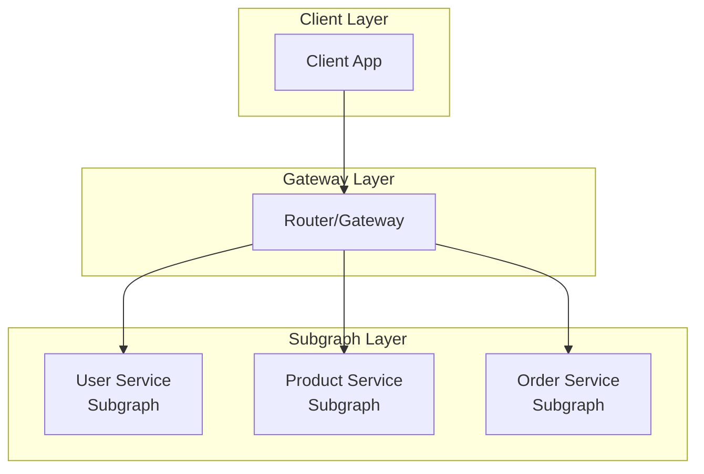

# GraphQL Federation - Hướng Dẫn Toàn Diện

> Tài liệu hướng dẫn triển khai GraphQL Federation trong NestJS cho các cấp độ từ Junior đến Senior.

## Mục Lục

1. [Giới Thiệu Tổng Quan](#1-giới-thiệu-tổng-quan)
2. [Junior Level - Cơ Bản](#2-junior-level---cơ-bản)
3. [Middle Level - Trung Cấp](#3-middle-level---trung-cấp)
4. [Senior Level - Nâng Cao](#4-senior-level---nâng-cao)
5. [Common Pitfalls](#5-common-pitfalls)
6. [Best Practices](#6-best-practices)

---

## 1. Giới Thiệu Tổng Quan

### 1.1. GraphQL Federation là gì?

**GraphQL Federation** là một kiến trúc cho phép bạn:
- Kết hợp nhiều GraphQL services (subgraphs) thành một unified API (supergraph)
- Cho phép các teams phát triển độc lập
- Cung cấp một entry point duy nhất cho clients



### 1.2. Tại sao sử dụng Federation?

| Vấn đề với Monolith GraphQL | Giải pháp Federation |
|----------------------------|----------------------|
| Single point of failure | Distributed services |
| Team bottleneck | Independent development |
| Scaling khó khăn | Scale từng service |
| Large codebase | Domain separation |

### 1.3. Core Concepts

#### Subgraph
- Service GraphQL **độc lập** với schema và resolvers riêng
- Quản lý một **domain** cụ thể (User, Product, Order, etc.)
- Có thể deploy và scale **độc lập**

#### Supergraph  
- **Schema hợp nhất** từ tất cả subgraphs
- Được tạo bởi **schema composition**
- Clients chỉ thấy supergraph, không biết về subgraphs

#### Router (Gateway)
- **Entry point duy nhất** cho clients
- **Orchestrate** requests đến các subgraphs
- Thực hiện **query planning** và optimization

#### Entity
- **Type được chia sẻ** giữa các subgraphs
- Được đánh dấu bằng directive `@key`
- Cho phép **cross-service references**

---

## 2. Junior Level - Cơ Bản

### 2.1. Cài Đặt Dependencies

#### Option 1: Apollo Federation Driver (Recommended)

```bash
npm install @nestjs/graphql @nestjs/apollo @apollo/server @apollo/subgraph graphql
```

#### Option 2: Yoga Federation Driver

```bash
npm install @nestjs/graphql @graphql-yoga/nestjs-federation graphql-yoga graphql
```

### 2.2. Tạo Subgraph Đầu Tiên

#### Step 1: Configure GraphQL Module với Federation

```typescript
// src/app.module.ts
import { Module } from '@nestjs/common';
import { GraphQLModule } from '@nestjs/graphql';
import { 
  ApolloFederationDriver, 
  ApolloFederationDriverConfig 
} from '@nestjs/apollo';
import { UserModule } from './user/user.module';

@Module({
  imports: [
    GraphQLModule.forRoot<ApolloFederationDriverConfig>({
      driver: ApolloFederationDriver,
      autoSchemaFile: {
        federation: 2, // Sử dụng Federation 2
      },
    }),
    UserModule,
  ],
})
export class AppModule {}
```

#### Step 2: Define Entity với @key Directive

```typescript
// src/user/models/user.model.ts
import { ObjectType, Field, ID, Directive } from '@nestjs/graphql';

@ObjectType()
@Directive('@key(fields: "id")') // Định nghĩa entity key
export class User {
  @Field(() => ID)
  id: string;

  @Field()
  username: string;

  @Field()
  email: string;

  @Field({ nullable: true })
  avatar?: string;
}
```

#### Step 3: Tạo Resolver

```typescript
// src/user/user.resolver.ts
import { Resolver, Query, Args, ID, ResolveReference } from '@nestjs/graphql';
import { User } from './models/user.model';
import { UserService } from './user.service';

@Resolver(() => User)
export class UserResolver {
  constructor(private readonly userService: UserService) {}

  @Query(() => User, { nullable: true })
  async user(@Args('id', { type: () => ID }) id: string): Promise<User> {
    return this.userService.findById(id);
  }

  @Query(() => [User])
  async users(): Promise<User[]> {
    return this.userService.findAll();
  }

  // QUAN TRỌNG: Resolve reference từ subgraph khác
  @ResolveReference()
  async resolveReference(reference: { __typename: string; id: string }): Promise<User> {
    return this.userService.findById(reference.id);
  }
}
```

### 2.3. Tạo Gateway

#### Step 1: Gateway Module Setup

```typescript
// gateway/src/app.module.ts
import { Module } from '@nestjs/common';
import { GraphQLModule } from '@nestjs/graphql';
import { ApolloGatewayDriver, ApolloGatewayDriverConfig } from '@nestjs/apollo';
import { IntrospectAndCompose } from '@apollo/gateway';

@Module({
  imports: [
    GraphQLModule.forRoot<ApolloGatewayDriverConfig>({
      driver: ApolloGatewayDriver,
      gateway: {
        supergraphSdl: new IntrospectAndCompose({
          subgraphs: [
            { name: 'users', url: 'http://localhost:3001/graphql' },
            { name: 'products', url: 'http://localhost:3002/graphql' },
            { name: 'orders', url: 'http://localhost:3003/graphql' },
          ],
        }),
      },
    }),
  ],
})
export class AppModule {}
```

### 2.4. Hello World Example

#### User Subgraph (Port 3001)

```typescript
// user-subgraph/src/user/user.resolver.ts
@Resolver(() => User)
export class UserResolver {
  private users: User[] = [
    { id: '1', username: 'john_doe', email: 'john@example.com' },
    { id: '2', username: 'jane_doe', email: 'jane@example.com' },
  ];

  @Query(() => [User])
  users(): User[] {
    return this.users;
  }

  @ResolveReference()
  resolveReference(ref: { id: string }): User {
    return this.users.find(u => u.id === ref.id);
  }
}
```

#### Product Subgraph (Port 3002)

```typescript
// product-subgraph/src/product/product.model.ts
@ObjectType()
@Directive('@key(fields: "id")')
export class Product {
  @Field(() => ID)
  id: string;

  @Field()
  name: string;

  @Field()
  price: number;
}
```

#### Test Query qua Gateway

```graphql
# Query từ Gateway (port 3000)
query {
  users {
    id
    username
    email
  }
  products {
    id
    name
    price
  }
}
```

---

## 3. Middle Level - Trung Cấp

### 3.1. Entity Resolution và Cross-service References

#### Extending Entity từ Subgraph khác

Khi một subgraph cần reference đến entity của subgraph khác:

```typescript
// order-subgraph/src/models/user-reference.model.ts
import { ObjectType, Field, ID, Directive } from '@nestjs/graphql';

@ObjectType()
@Directive('@key(fields: "id")')
@Directive('@extends') // Extend từ User subgraph
export class User {
  @Field(() => ID)
  @Directive('@external') // Field được định nghĩa ở subgraph khác
  id: string;

  // Không cần định nghĩa các fields khác
}
```

```typescript
// order-subgraph/src/models/order.model.ts
@ObjectType()
@Directive('@key(fields: "id")')
export class Order {
  @Field(() => ID)
  id: string;

  @Field()
  totalAmount: number;

  @Field(() => User)
  user: User; // Reference đến User entity

  @Field()
  createdAt: Date;
}
```

```typescript
// order-subgraph/src/order.resolver.ts
@Resolver(() => Order)
export class OrderResolver {
  @Query(() => [Order])
  orders(): Order[] {
    return [
      {
        id: 'order-1',
        totalAmount: 99.99,
        user: { id: '1' }, // Chỉ cần id, Gateway sẽ resolve đầy đủ
        createdAt: new Date(),
      },
    ];
  }

  // Resolve field user
  @ResolveField(() => User)
  user(@Parent() order: Order): { __typename: string; id: string } {
    return { __typename: 'User', id: order.user.id };
  }
}
```

### 3.2. Federation Directives Chi Tiết

| Directive | Mục đích | Ví dụ |
|-----------|----------|-------|
| `@key` | Define entity primary key | `@Directive('@key(fields: "id")')` |
| `@external` | Mark field từ subgraph khác | `@Directive('@external')` |
| `@extends` | Extend type từ subgraph khác | `@Directive('@extends')` |
| `@requires` | Specify required fields để resolve | `@Directive('@requires(fields: "price")')` |
| `@provides` | Declare fields được provided | `@Directive('@provides(fields: "name")')` |
| `@shareable` | Allow field ở nhiều subgraphs | `@Directive('@shareable')` |

### 3.3. @requires Directive

Sử dụng khi cần fields từ subgraph khác để compute một field:

```typescript
// inventory-subgraph
@ObjectType()
@Directive('@extends')
@Directive('@key(fields: "id")')
export class Product {
  @Field(() => ID)
  @Directive('@external')
  id: string;

  @Field()
  @Directive('@external')
  price: number;

  @Field()
  @Directive('@requires(fields: "price")') // Cần price để tính shippingCost
  shippingCost: number;
}

@Resolver(() => Product)
export class ProductResolver {
  @ResolveField(() => Number)
  shippingCost(@Parent() product: Product): number {
    // Tính shipping dựa trên price
    return product.price > 100 ? 0 : 9.99;
  }
}
```

### 3.4. Multiple Keys

Entity có thể có nhiều keys cho các scenarios khác nhau:

```typescript
@ObjectType()
@Directive('@key(fields: "id")')
@Directive('@key(fields: "sku")')
@Directive('@key(fields: "upc")')
export class Product {
  @Field(() => ID)
  id: string;

  @Field()
  sku: string;

  @Field()
  upc: string;

  @Field()
  name: string;
}
```

---

## 4. Senior Level - Nâng Cao

### 4.1. Custom Gateway Configuration

```typescript
// gateway/src/app.module.ts
import { 
  ApolloGateway, 
  IntrospectAndCompose,
  RemoteGraphQLDataSource 
} from '@apollo/gateway';

const gateway = new ApolloGateway({
  supergraphSdl: new IntrospectAndCompose({
    subgraphs: [
      { name: 'users', url: process.env.USERS_URL },
      { name: 'products', url: process.env.PRODUCTS_URL },
    ],
    pollIntervalInMs: 10000, // Refresh mỗi 10s
  }),
  buildService({ name, url }) {
    return new RemoteGraphQLDataSource({
      url,
      willSendRequest({ request, context }) {
        // Forward headers
        request.http.headers.set(
          'authorization',
          context.req?.headers.authorization
        );
        request.http.headers.set(
          'x-correlation-id',
          context.correlationId
        );
      },
    });
  },
});
```

### 4.2. Supergraph Schema từ File (Production)

```typescript
// gateway/src/app.module.ts
import { readFileSync } from 'fs';

@Module({
  imports: [
    GraphQLModule.forRoot<ApolloGatewayDriverConfig>({
      driver: ApolloGatewayDriver,
      gateway: {
        // Đọc supergraph từ file (generated by rover compose)
        supergraphSdl: readFileSync('./supergraph.graphql', 'utf-8'),
      },
    }),
  ],
})
export class AppModule {}
```

### 4.3. Error Handling trong Federation

```typescript
// Subgraph error handling
@Resolver(() => Order)
export class OrderResolver {
  @ResolveReference()
  async resolveReference(
    reference: { __typename: string; id: string }
  ): Promise<Order | null> {
    try {
      const order = await this.orderService.findById(reference.id);
      if (!order) {
        throw new GraphQLError(`Order ${reference.id} not found`, {
          extensions: {
            code: 'ORDER_NOT_FOUND',
            http: { status: 404 },
          },
        });
      }
      return order;
    } catch (error) {
      // Log error for monitoring
      this.logger.error(`Failed to resolve order: ${reference.id}`, error);
      throw error;
    }
  }
}
```

### 4.4. Schema Registry với Apollo GraphOS

```bash
# Install Rover CLI
curl -sSL https://rover.apollo.dev/nix/latest | sh

# Publish subgraph schema
rover subgraph publish my-graph@production \
  --name users \
  --schema ./user-subgraph/schema.graphql \
  --routing-url http://users-service:3001/graphql

# Check schema compatibility
rover subgraph check my-graph@production \
  --name users \
  --schema ./user-subgraph/schema.graphql
```

---

## 5. Common Pitfalls

### ❌ Pitfall 1: Quên @ResolveReference

```typescript
// ❌ SAI: Entity không có resolveReference
@Resolver(() => User)
export class UserResolver {
  @Query(() => [User])
  users(): User[] {
    return this.users;
  }
  // Missing @ResolveReference!
}

// ✅ ĐÚNG: Có resolveReference để Gateway resolve entity
@Resolver(() => User)
export class UserResolver {
  @Query(() => [User])
  users(): User[] {
    return this.users;
  }

  @ResolveReference()
  resolveReference(ref: { id: string }): User {
    return this.userService.findById(ref.id);
  }
}
```

### ❌ Pitfall 2: Circular Dependencies

```typescript
// ❌ SAI: User -> Order -> User (circular)
// User subgraph
@ObjectType()
export class User {
  @Field(() => [Order])
  orders: Order[]; // Depends on Order
}

// Order subgraph
@ObjectType()
export class Order {
  @Field(() => User)
  user: User; // Depends on User - CIRCULAR!
}

// ✅ ĐÚNG: Một direction duy nhất
// Order subgraph extends User (chỉ reference, không định nghĩa)
@ObjectType()
@Directive('@extends')
@Directive('@key(fields: "id")')
export class User {
  @Field(() => ID)
  @Directive('@external')
  id: string;
}
```

### ❌ Pitfall 3: Sai Context trong Gateway

```typescript
// ❌ SAI: Không forward context từ Gateway
const gateway = new ApolloGateway({
  supergraphSdl: new IntrospectAndCompose({
    subgraphs: [...],
  }),
  // Missing buildService configuration!
});

// ✅ ĐÚNG: Forward context
const gateway = new ApolloGateway({
  buildService({ url }) {
    return new RemoteGraphQLDataSource({
      url,
      willSendRequest({ request, context }) {
        // Forward authentication
        request.http.headers.set(
          'authorization',
          context.req.headers.authorization
        );
      },
    });
  },
});
```

---

## 6. Best Practices

### ✅ 1. Domain-Driven Design

Mỗi subgraph nên represent một **bounded context**:

```
✅ Good:
- user-subgraph (Authentication, Profile)
- product-subgraph (Catalog, Inventory)
- order-subgraph (Orders, Payments)

❌ Bad:
- crud-subgraph (All CRUD operations)
- api-subgraph (Everything)
```

### ✅ 2. Explicit Entity Ownership

```typescript
// Chỉ owner subgraph mới có full entity definition
// User Subgraph - OWNER
@ObjectType()
@Directive('@key(fields: "id")')
export class User {
  @Field(() => ID)
  id: string;

  @Field()
  email: string;

  @Field()
  name: string;
  
  // Full definition...
}

// Order Subgraph - CONSUMER (chỉ extend)
@ObjectType()
@Directive('@extends')
@Directive('@key(fields: "id")')
export class User {
  @Field(() => ID)
  @Directive('@external')
  id: string;
  // Chỉ cần id để reference
}
```

### ✅ 3. Versioning với Schema Registry

```bash
# CI/CD Pipeline
# 1. Check compatibility trước khi deploy
rover subgraph check my-graph@production \
  --name users \
  --schema ./schema.graphql

# 2. Chỉ publish nếu check pass
rover subgraph publish my-graph@production \
  --name users \
  --schema ./schema.graphql
```

### ✅ 4. Health Checks

```typescript
// Mỗi subgraph cần health check endpoint
@Controller('health')
export class HealthController {
  @Get()
  check() {
    return {
      status: 'ok',
      timestamp: new Date().toISOString(),
      subgraph: 'users',
    };
  }

  @Get('graphql')
  async checkGraphQL(@Inject(GraphQLSchemaHost) schemaHost: GraphQLSchemaHost) {
    const schema = schemaHost.schema;
    return {
      status: schema ? 'ok' : 'error',
      schemaLoaded: !!schema,
    };
  }
}
```

### ✅ 5. Observability

```typescript
// Tracing cho distributed queries
import { ApolloServerPluginInlineTrace } from '@apollo/server/plugin/inline-trace';

GraphQLModule.forRoot<ApolloFederationDriverConfig>({
  driver: ApolloFederationDriver,
  plugins: [
    ApolloServerPluginInlineTrace(),
  ],
});
```

---

## Tài Liệu Tham Khảo

- [Apollo Federation Documentation](https://www.apollographql.com/docs/federation/)
- [NestJS GraphQL Federation](https://docs.nestjs.com/graphql/federation)
- [GraphQL Federation Spec](https://graphql.org/learn/federation/)
- [Rover CLI Documentation](https://www.apollographql.com/docs/rover/)
