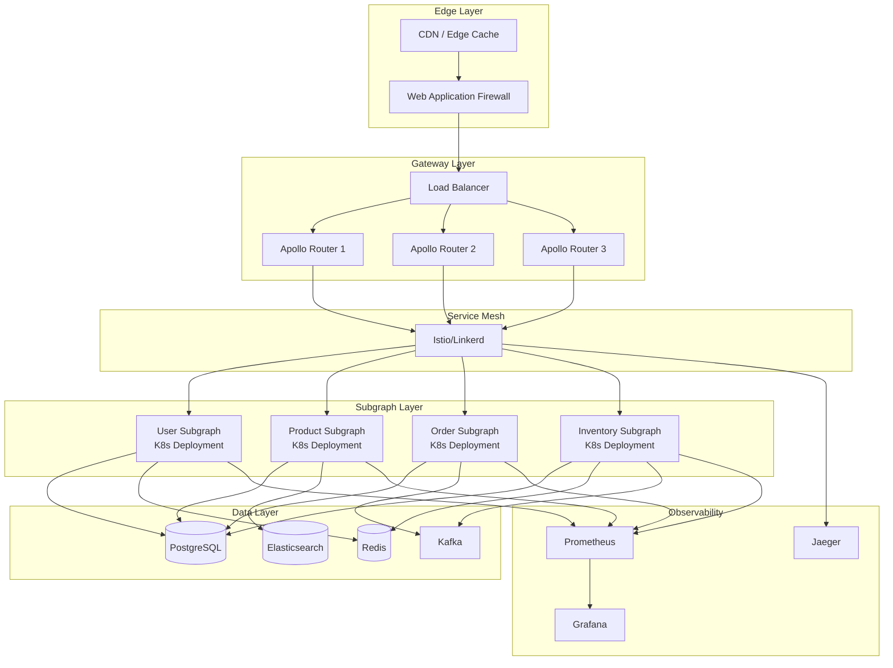
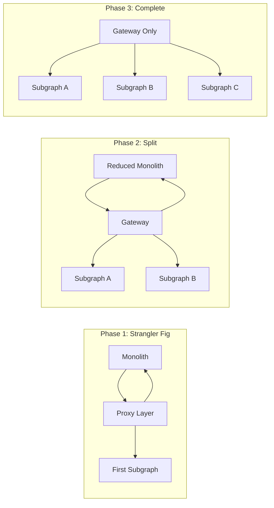

# Principal Level Patterns - GraphQL Federation

> Enterprise-scale patterns cho Principal/Staff engineers: System design, Multi-tenancy, Migration strategies, và Production best practices.

## Mục Lục

1. [Enterprise Architecture](#1-enterprise-architecture)
2. [Multi-tenancy Patterns](#2-multi-tenancy-patterns)
3. [Migration Strategies](#3-migration-strategies)
4. [Production Infrastructure](#4-production-infrastructure)
5. [Governance & Team Ownership](#5-governance--team-ownership)
6. [Security Patterns](#6-security-patterns)

---

## 1. Enterprise Architecture

### 1.1. Reference Architecture



### 1.2. Schema Registry Architecture

```typescript
// infrastructure/schema-registry/registry.service.ts
import { Injectable } from '@nestjs/common';
import { S3 } from '@aws-sdk/client-s3';
import { composeServices } from '@apollo/composition';

interface SchemaVersion {
  version: string;
  subgraph: string;
  schema: string;
  publishedAt: Date;
  publishedBy: string;
  checksPassed: boolean;
}

@Injectable()
export class SchemaRegistryService {
  constructor(
    private readonly s3: S3,
    private readonly database: DatabaseService,
  ) {}

  async publishSchema(
    subgraph: string,
    schema: string,
    author: string,
  ): Promise<{ success: boolean; version: string; errors?: string[] }> {
    // 1. Validate schema syntax
    const syntaxErrors = this.validateSyntax(schema);
    if (syntaxErrors.length > 0) {
      return { success: false, version: null, errors: syntaxErrors };
    }

    // 2. Get all current schemas
    const currentSchemas = await this.getAllCurrentSchemas();
    
    // 3. Replace/add the new subgraph schema
    const updatedSchemas = currentSchemas.map(s => 
      s.name === subgraph ? { ...s, typeDefs: schema } : s
    );
    if (!currentSchemas.find(s => s.name === subgraph)) {
      updatedSchemas.push({ name: subgraph, typeDefs: schema });
    }

    // 4. Compose and validate
    const compositionResult = composeServices(updatedSchemas);
    if (compositionResult.errors) {
      return {
        success: false,
        version: null,
        errors: compositionResult.errors.map(e => e.message),
      };
    }

    // 5. Run breaking change detection
    const breakingChanges = await this.detectBreakingChanges(
      subgraph,
      schema
    );
    if (breakingChanges.length > 0) {
      return {
        success: false,
        version: null,
        errors: breakingChanges.map(c => `Breaking change: ${c}`),
      };
    }

    // 6. Store new version
    const version = `${subgraph}-${Date.now()}`;
    await this.storeSchema(subgraph, schema, version, author);

    // 7. Update supergraph
    await this.deploySupergraph(compositionResult.supergraphSdl);

    return { success: true, version };
  }

  private async deploySupergraph(supergraphSdl: string): Promise<void> {
    // Deploy to CDN for Apollo Router to fetch
    await this.s3.putObject({
      Bucket: process.env.SUPERGRAPH_BUCKET,
      Key: 'supergraph.graphql',
      Body: supergraphSdl,
      ContentType: 'text/plain',
    });

    // Invalidate CDN cache
    await this.invalidateCDNCache('/supergraph.graphql');
  }
}
```

### 1.3. Centralized API Client

```typescript
// shared/src/api-client/federated-client.ts
import { GraphQLClient } from 'graphql-request';
import { v4 as uuidv4 } from 'uuid';

interface ClientConfig {
  gatewayUrl: string;
  serviceName: string;
  serviceVersion: string;
}

export class FederatedApiClient {
  private client: GraphQLClient;
  private interceptors: RequestInterceptor[] = [];

  constructor(private config: ClientConfig) {
    this.client = new GraphQLClient(config.gatewayUrl);
    this.setupDefaultInterceptors();
  }

  private setupDefaultInterceptors() {
    // Correlation ID
    this.addInterceptor({
      beforeRequest: (context) => {
        context.headers['x-correlation-id'] = context.correlationId || uuidv4();
        return context;
      },
    });

    // Service identification
    this.addInterceptor({
      beforeRequest: (context) => {
        context.headers['x-client-name'] = this.config.serviceName;
        context.headers['x-client-version'] = this.config.serviceVersion;
        return context;
      },
    });

    // Request timing
    this.addInterceptor({
      beforeRequest: (context) => {
        context.startTime = Date.now();
        return context;
      },
      afterResponse: (context, response) => {
        const duration = Date.now() - context.startTime;
        this.recordMetric('graphql_request_duration', duration, {
          operation: context.operationName,
          status: response.errors ? 'error' : 'success',
        });
        return response;
      },
    });

    // Retry logic
    this.addInterceptor({
      onError: async (error, context, retry) => {
        if (this.isRetryable(error) && context.retryCount < 3) {
          const delay = Math.pow(2, context.retryCount) * 100;
          await new Promise(r => setTimeout(r, delay));
          return retry({ ...context, retryCount: context.retryCount + 1 });
        }
        throw error;
      },
    });
  }

  async request<T>(
    query: string,
    variables?: Record<string, any>,
    context?: RequestContext,
  ): Promise<T> {
    let requestContext = {
      query,
      variables,
      headers: {},
      retryCount: 0,
      ...context,
    };

    // Apply before interceptors
    for (const interceptor of this.interceptors) {
      if (interceptor.beforeRequest) {
        requestContext = interceptor.beforeRequest(requestContext);
      }
    }

    try {
      const response = await this.client.request<T>(
        query,
        variables,
        requestContext.headers,
      );

      // Apply after interceptors
      let result = response;
      for (const interceptor of this.interceptors) {
        if (interceptor.afterResponse) {
          result = interceptor.afterResponse(requestContext, result);
        }
      }

      return result;
    } catch (error) {
      // Apply error interceptors
      for (const interceptor of this.interceptors) {
        if (interceptor.onError) {
          return interceptor.onError(
            error, 
            requestContext,
            (ctx) => this.request(query, variables, ctx)
          );
        }
      }
      throw error;
    }
  }
}
```

---

## 2. Multi-tenancy Patterns

### 2.1. Tenant-Aware Gateway

```typescript
// gateway/src/middleware/tenant.middleware.ts
import { Injectable, NestMiddleware } from '@nestjs/common';
import { Request, Response, NextFunction } from 'express';

@Injectable()
export class TenantMiddleware implements NestMiddleware {
  constructor(private readonly tenantService: TenantService) {}

  async use(req: Request, res: Response, next: NextFunction) {
    // Extract tenant from subdomain, header, or JWT
    const tenantId = this.extractTenant(req);
    
    if (!tenantId) {
      res.status(400).json({ error: 'Tenant identification required' });
      return;
    }

    // Validate tenant
    const tenant = await this.tenantService.findById(tenantId);
    if (!tenant || !tenant.isActive) {
      res.status(403).json({ error: 'Invalid or inactive tenant' });
      return;
    }

    // Attach tenant context
    req['tenant'] = tenant;
    
    next();
  }

  private extractTenant(req: Request): string | null {
    // Priority: Header > Subdomain > JWT claim
    if (req.headers['x-tenant-id']) {
      return req.headers['x-tenant-id'] as string;
    }

    const host = req.hostname;
    const subdomain = host.split('.')[0];
    if (subdomain && subdomain !== 'www' && subdomain !== 'api') {
      return subdomain;
    }

    if (req['user']?.tenantId) {
      return req['user'].tenantId;
    }

    return null;
  }
}
```

### 2.2. Tenant Context Propagation

```typescript
// gateway/src/context/tenant-context.ts
import { RemoteGraphQLDataSource } from '@apollo/gateway';

export class TenantAwareDataSource extends RemoteGraphQLDataSource {
  willSendRequest({ request, context }) {
    // Propagate tenant context to all subgraphs
    if (context.tenant) {
      request.http.headers.set('x-tenant-id', context.tenant.id);
      request.http.headers.set('x-tenant-config', JSON.stringify({
        tier: context.tenant.tier,
        features: context.tenant.features,
        limits: context.tenant.limits,
      }));
    }
  }
}

// subgraph/src/decorators/tenant.decorator.ts
import { createParamDecorator, ExecutionContext } from '@nestjs/common';
import { GqlExecutionContext } from '@nestjs/graphql';

export const CurrentTenant = createParamDecorator(
  (data: unknown, context: ExecutionContext) => {
    const ctx = GqlExecutionContext.create(context);
    const request = ctx.getContext().req;
    return request.tenant;
  },
);
```

### 2.3. Per-Tenant Rate Limiting

```typescript
// gateway/src/rate-limit/tenant-rate-limiter.ts
interface TenantLimits {
  requestsPerMinute: number;
  queryComplexityBudget: number;
  maxConcurrentRequests: number;
}

const TIER_LIMITS: Record<string, TenantLimits> = {
  free: { requestsPerMinute: 100, queryComplexityBudget: 1000, maxConcurrentRequests: 5 },
  starter: { requestsPerMinute: 1000, queryComplexityBudget: 5000, maxConcurrentRequests: 20 },
  enterprise: { requestsPerMinute: 10000, queryComplexityBudget: 50000, maxConcurrentRequests: 100 },
};

@Injectable()
export class TenantRateLimiter {
  constructor(private readonly redis: Redis) {}

  async checkLimit(tenantId: string, tier: string): Promise<boolean> {
    const limits = TIER_LIMITS[tier] || TIER_LIMITS.free;
    const key = `rate:${tenantId}:${this.getCurrentMinute()}`;
    
    const current = await this.redis.incr(key);
    if (current === 1) {
      await this.redis.expire(key, 60);
    }

    return current <= limits.requestsPerMinute;
  }

  async checkConcurrency(tenantId: string, tier: string): Promise<boolean> {
    const limits = TIER_LIMITS[tier] || TIER_LIMITS.free;
    const key = `concurrent:${tenantId}`;
    
    const current = await this.redis.get(key);
    return parseInt(current || '0') < limits.maxConcurrentRequests;
  }
}
```

---

## 3. Migration Strategies

### 3.1. Monolith to Federation Migration



### 3.2. Migration Script Template

```typescript
// migration/strangler-proxy.ts
import { ApolloGateway, IntrospectAndCompose, RemoteGraphQLDataSource } from '@apollo/gateway';

interface MigrationConfig {
  legacyEndpoint: string;
  migratedTypes: string[];
  subgraphs: Array<{ name: string; url: string }>;
}

export function createMigrationGateway(config: MigrationConfig) {
  return new ApolloGateway({
    supergraphSdl: new IntrospectAndCompose({
      subgraphs: [
        // Legacy monolith as a subgraph
        { 
          name: 'legacy', 
          url: config.legacyEndpoint 
        },
        // New microservices
        ...config.subgraphs,
      ],
    }),
    buildService({ name, url }) {
      if (name === 'legacy') {
        return new LegacyDataSource({ 
          url, 
          migratedTypes: config.migratedTypes 
        });
      }
      return new RemoteGraphQLDataSource({ url });
    },
  });
}

class LegacyDataSource extends RemoteGraphQLDataSource {
  constructor(
    config: { url: string; migratedTypes: string[] }
  ) {
    super({ url: config.url });
    this.migratedTypes = config.migratedTypes;
  }

  willSendRequest({ request }) {
    // Log queries still going to legacy system
    console.log({
      type: 'LEGACY_QUERY',
      query: request.query,
      timestamp: new Date().toISOString(),
    });
  }
}
```

### 3.3. Data Migration Pattern

```typescript
// migration/dual-write.service.ts
@Injectable()
export class DualWriteService {
  constructor(
    private readonly legacyDb: LegacyDatabase,
    private readonly newDb: NewDatabase,
    private readonly metrics: MetricsService,
  ) {}

  async createUser(data: CreateUserDto): Promise<User> {
    // Write to both databases
    const [legacyResult, newResult] = await Promise.allSettled([
      this.legacyDb.users.create(this.toLegacyFormat(data)),
      this.newDb.users.create(data),
    ]);

    // Track consistency
    if (legacyResult.status === 'fulfilled' && newResult.status === 'fulfilled') {
      this.metrics.increment('dual_write.success');
      
      // Verify data consistency
      const isConsistent = this.verifyConsistency(
        legacyResult.value,
        newResult.value
      );
      this.metrics.increment(
        isConsistent ? 'dual_write.consistent' : 'dual_write.inconsistent'
      );
    } else {
      this.metrics.increment('dual_write.failure');
      
      // Handle partial failure
      await this.handlePartialFailure(data, legacyResult, newResult);
    }

    // Return from new database (primary source of truth)
    if (newResult.status === 'fulfilled') {
      return newResult.value;
    }

    // Fallback to legacy
    return this.toNewFormat(legacyResult.value);
  }
}
```

---

## 4. Production Infrastructure

### 4.1. Kubernetes Deployment

```yaml
# k8s/gateway-deployment.yaml
apiVersion: apps/v1
kind: Deployment
metadata:
  name: graphql-gateway
spec:
  replicas: 3
  selector:
    matchLabels:
      app: graphql-gateway
  template:
    metadata:
      labels:
        app: graphql-gateway
      annotations:
        prometheus.io/scrape: "true"
        prometheus.io/port: "9090"
    spec:
      containers:
        - name: gateway
          image: apollo-router:v1.x
          ports:
            - containerPort: 4000
            - containerPort: 9090
          env:
            - name: APOLLO_ROUTER_SUPERGRAPH_PATH
              value: /config/supergraph.graphql
            - name: APOLLO_ROUTER_CONFIG_PATH
              value: /config/router.yaml
          resources:
            requests:
              memory: "512Mi"
              cpu: "500m"
            limits:
              memory: "2Gi"
              cpu: "2000m"
          livenessProbe:
            httpGet:
              path: /health
              port: 4000
            initialDelaySeconds: 10
            periodSeconds: 5
          readinessProbe:
            httpGet:
              path: /health?ready
              port: 4000
            initialDelaySeconds: 5
            periodSeconds: 3
          volumeMounts:
            - name: config
              mountPath: /config
      volumes:
        - name: config
          configMap:
            name: gateway-config
---
apiVersion: autoscaling/v2
kind: HorizontalPodAutoscaler
metadata:
  name: graphql-gateway-hpa
spec:
  scaleTargetRef:
    apiVersion: apps/v1
    kind: Deployment
    name: graphql-gateway
  minReplicas: 3
  maxReplicas: 20
  metrics:
    - type: Resource
      resource:
        name: cpu
        target:
          type: Utilization
          averageUtilization: 70
    - type: Pods
      pods:
        metric:
          name: graphql_request_count
        target:
          type: AverageValue
          averageValue: 1000
```

### 4.2. Apollo Router Configuration

```yaml
# config/router.yaml
supergraph:
  listen: 0.0.0.0:4000
  introspection: true
  
headers:
  all:
    request:
      - propagate:
          matching: "x-.*"
      - propagate:
          named: "authorization"
      - insert:
          name: "x-gateway-version"
          value: "v1.0.0"

traffic_shaping:
  all:
    timeout: 30s
  subgraphs:
    users:
      timeout: 10s
    products:
      timeout: 15s

telemetry:
  apollo:
    field_level_instrumentation_sampler: always_on
  tracing:
    propagation:
      jaeger: true
    otlp:
      enabled: true
      endpoint: http://otel-collector:4317
  metrics:
    prometheus:
      enabled: true
      listen: 0.0.0.0:9090
      path: /metrics

cors:
  origins:
    - https://app.example.com
    - https://admin.example.com
  methods:
    - GET
    - POST
    - OPTIONS

limits:
  max_depth: 10
  max_height: 100
  max_aliases: 30
  max_root_fields: 20

persisted_queries:
  enabled: true
  safelist:
    enabled: true
    require_id: true
```

### 4.3. CI/CD Pipeline

```yaml
# .github/workflows/federation-deploy.yaml
name: Federation Deploy

on:
  push:
    branches: [main]
    paths:
      - 'subgraphs/**'
      - 'gateway/**'

jobs:
  schema-check:
    runs-on: ubuntu-latest
    strategy:
      matrix:
        subgraph: [users, products, orders]
    steps:
      - uses: actions/checkout@v3
      
      - name: Install Rover
        run: curl -sSL https://rover.apollo.dev/nix/latest | sh
        
      - name: Schema Check
        run: |
          rover subgraph check ${{ secrets.APOLLO_GRAPH_REF }} \
            --name ${{ matrix.subgraph }} \
            --schema ./subgraphs/${{ matrix.subgraph }}/schema.graphql
        env:
          APOLLO_KEY: ${{ secrets.APOLLO_KEY }}

  deploy-subgraph:
    needs: schema-check
    runs-on: ubuntu-latest
    strategy:
      matrix:
        subgraph: [users, products, orders]
    steps:
      - name: Deploy to Kubernetes
        run: |
          kubectl set image deployment/${{ matrix.subgraph }}-subgraph \
            ${{ matrix.subgraph }}=${{ env.REGISTRY }}/${{ matrix.subgraph }}:${{ github.sha }}
          kubectl rollout status deployment/${{ matrix.subgraph }}-subgraph

      - name: Publish Schema
        run: |
          rover subgraph publish ${{ secrets.APOLLO_GRAPH_REF }} \
            --name ${{ matrix.subgraph }} \
            --schema ./subgraphs/${{ matrix.subgraph }}/schema.graphql \
            --routing-url https://${{ matrix.subgraph }}.internal/graphql
        env:
          APOLLO_KEY: ${{ secrets.APOLLO_KEY }}

  smoke-test:
    needs: deploy-subgraph
    runs-on: ubuntu-latest
    steps:
      - name: Run Smoke Tests
        run: |
          npx graphql-inspector validate \
            ./tests/smoke-queries/*.graphql \
            ${{ secrets.GATEWAY_URL }}
```

---

## 5. Governance & Team Ownership

### 5.1. Subgraph Ownership Model

```typescript
// governance/ownership.config.ts
interface SubgraphOwnership {
  subgraph: string;
  team: string;
  slackChannel: string;
  pagerdutyKey: string;
  slo: {
    availability: number;
    latencyP99: number;
  };
}

export const OWNERSHIP: SubgraphOwnership[] = [
  {
    subgraph: 'users',
    team: 'identity-team',
    slackChannel: '#identity-alerts',
    pagerdutyKey: 'xxx',
    slo: { availability: 99.99, latencyP99: 100 },
  },
  {
    subgraph: 'products',
    team: 'catalog-team',
    slackChannel: '#catalog-alerts',
    pagerdutyKey: 'yyy',
    slo: { availability: 99.9, latencyP99: 200 },
  },
];
```

### 5.2. Schema Review Process

```typescript
// governance/schema-review.ts
interface SchemaChangeRequest {
  subgraph: string;
  author: string;
  changes: {
    type: 'ADD' | 'MODIFY' | 'REMOVE';
    target: string;
    description: string;
  }[];
  breakingChanges: string[];
}

@Injectable()
export class SchemaGovernanceService {
  async requestSchemaChange(request: SchemaChangeRequest): Promise<void> {
    // 1. Auto-approve non-breaking additions
    if (request.breakingChanges.length === 0 && 
        request.changes.every(c => c.type === 'ADD')) {
      await this.autoApprove(request);
      return;
    }

    // 2. Breaking changes require review
    if (request.breakingChanges.length > 0) {
      await this.createReviewRequest(request, {
        requiredApprovers: ['platform-team', 'api-governance'],
        notifyConsumers: true,
      });
      return;
    }

    // 3. Modifications require owner approval
    await this.createReviewRequest(request, {
      requiredApprovers: [this.getOwnerTeam(request.subgraph)],
    });
  }

  private async notifyConsumers(subgraph: string, changes: string[]) {
    const consumers = await this.findConsumers(subgraph);
    
    for (const consumer of consumers) {
      await this.slack.postMessage(consumer.slackChannel, {
        text: `⚠️ Breaking changes planned for ${subgraph}`,
        blocks: [
          {
            type: 'section',
            text: {
              type: 'mrkdwn',
              text: changes.map(c => `• ${c}`).join('\n'),
            },
          },
        ],
      });
    }
  }
}
```

---

## 6. Security Patterns

### 6.1. Field-Level Authorization

```typescript
// subgraph/src/auth/field-auth.guard.ts
import { CanActivate, ExecutionContext, Injectable } from '@nestjs/common';
import { Reflector } from '@nestjs/core';
import { GqlExecutionContext } from '@nestjs/graphql';

@Injectable()
export class FieldAuthGuard implements CanActivate {
  constructor(private reflector: Reflector) {}

  canActivate(context: ExecutionContext): boolean {
    const requiredRoles = this.reflector.get<string[]>(
      'roles',
      context.getHandler()
    );
    
    if (!requiredRoles) {
      return true;
    }

    const ctx = GqlExecutionContext.create(context);
    const user = ctx.getContext().req.user;

    if (!user) {
      return false;
    }

    return requiredRoles.some(role => user.roles.includes(role));
  }
}

// Usage
@ObjectType()
export class User {
  @Field()
  id: string;

  @Field()
  email: string;

  @Field()
  @Roles('admin', 'self')
  ssn: string; // Only admin or user themselves can see

  @Field()
  @Roles('admin')
  internalNotes: string; // Only admin
}
```

### 6.2. Query Complexity Analysis

```typescript
// gateway/src/plugins/complexity.plugin.ts
import { getComplexity, simpleEstimator, fieldExtensionsEstimator } from 'graphql-query-complexity';

export const ComplexityPlugin: ApolloServerPlugin = {
  async requestDidStart() {
    return {
      async didResolveOperation({ request, document, schema, contextValue }) {
        const complexity = getComplexity({
          schema,
          query: document,
          variables: request.variables,
          estimators: [
            fieldExtensionsEstimator(),
            simpleEstimator({ defaultComplexity: 1 }),
          ],
        });

        const maxComplexity = contextValue.tenant?.tier === 'enterprise' 
          ? 50000 
          : 1000;

        if (complexity > maxComplexity) {
          throw new GraphQLError(
            `Query complexity ${complexity} exceeds maximum ${maxComplexity}`,
            {
              extensions: {
                code: 'QUERY_TOO_COMPLEX',
                complexity,
                maxComplexity,
              },
            }
          );
        }

        // Log for monitoring
        contextValue.queryComplexity = complexity;
      },
    };
  },
};
```

---

## Tài Liệu Tham Khảo

- [Apollo Federation Enterprise](https://www.apollographql.com/docs/technotes/)
- [GraphOS Platform](https://www.apollographql.com/docs/graphos/)
- [Apollo Router Deployment](https://www.apollographql.com/docs/router/containerization/kubernetes)
- [Schema Governance Best Practices](https://www.apollographql.com/docs/technotes/TN0014-contracts-and-schema-governance/)
