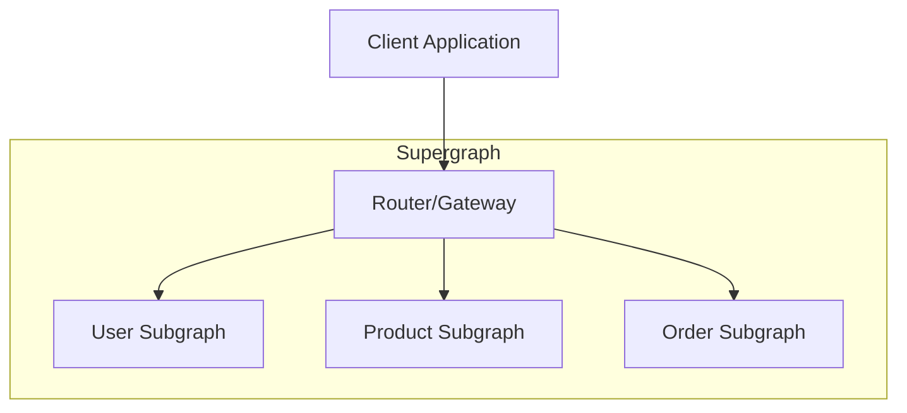

# GraphQL Federation trong NestJS

Tài liệu tổng hợp về GraphQL Federation và cách triển khai trong NestJS microservices architecture.

## Tổng Quan

**GraphQL Federation** là một kiến trúc cho phép kết hợp nhiều GraphQL APIs độc lập (subgraphs) thành một unified GraphQL API (supergraph). Điều này cho phép các team phát triển độc lập trong khi vẫn cung cấp một API duy nhất cho clients.

## Cấu Trúc Tài Liệu

| File | Mô tả | Đối tượng |
|------|-------|-----------|
| [GraphQL-Federation.md](./GraphQL-Federation.md) | Core concepts, setup, và sử dụng cơ bản | Junior → Senior |
| [Advanced-Patterns.md](./Advanced-Patterns.md) | Patterns nâng cao, performance, testing | Senior |
| [Principal-Level-Patterns.md](./Principal-Level-Patterns.md) | Enterprise patterns, system design | Principal/Staff |
| [RESEARCH_SUMMARY.md](./RESEARCH_SUMMARY.md) | Tóm tắt nguồn tham khảo | Reference |

## Cách Sử Dụng Tài Liệu

### Cho Junior Developer
1. Đọc phần **Giới Thiệu** và **Core Concepts** trong `GraphQL-Federation.md`
2. Thực hành các ví dụ **Hello World** và **Basic Setup**
3. Hiểu các khái niệm: Subgraph, Supergraph, Gateway, Entity

### Cho Middle Developer
1. Hoàn thành nội dung Junior
2. Đọc phần **Entity Resolution** và **Cross-service References**
3. Thực hành triển khai multiple subgraphs

### Cho Senior Developer
1. Hoàn thành nội dung Junior + Middle
2. Đọc `Advanced-Patterns.md` về performance optimization
3. Tìm hiểu schema composition và conflict resolution

### Cho Principal/Staff Engineer
1. Đọc `Principal-Level-Patterns.md` về enterprise patterns
2. Evaluate migration strategies và system design
3. Thiết kế governance và team ownership

## Key Concepts



### Các thành phần chính:
- **Subgraph**: Service GraphQL độc lập, quản lý một domain cụ thể
- **Supergraph**: Schema hợp nhất từ tất cả subgraphs
- **Router/Gateway**: Entry point duy nhất cho clients, orchestrate requests
- **Entity**: Types được chia sẻ giữa các subgraphs

## Quick Start

### Cài đặt dependencies

```bash
# Với Apollo Federation Driver
npm install @nestjs/graphql @nestjs/apollo @apollo/server @apollo/subgraph graphql

# Hoặc với Yoga Federation Driver
npm install @nestjs/graphql @graphql-yoga/nestjs-federation graphql-yoga graphql
```

### Basic Subgraph Setup

```typescript
// app.module.ts
import { ApolloFederationDriver, ApolloFederationDriverConfig } from '@nestjs/apollo';
import { Module } from '@nestjs/common';
import { GraphQLModule } from '@nestjs/graphql';

@Module({
  imports: [
    GraphQLModule.forRoot<ApolloFederationDriverConfig>({
      driver: ApolloFederationDriver,
      autoSchemaFile: { federation: 2 },
    }),
  ],
})
export class AppModule {}
```

## External Resources

- [GraphQL Federation Spec](https://graphql.org/learn/federation/)
- [Apollo Federation Docs](https://www.apollographql.com/docs/federation/)
- [NestJS GraphQL Docs](https://docs.nestjs.com/graphql/federation)
- [GraphQL Yoga NestJS Integration](https://the-guild.dev/graphql/yoga-server/docs/integrations/integration-with-nestjs)
