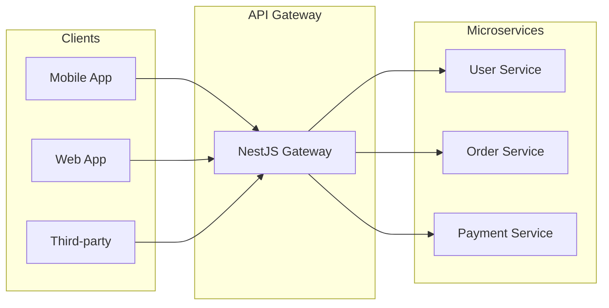

# NestJS API Gateway - Hướng Dẫn Chi Tiết

> **Tóm tắt:** Hướng dẫn toàn diện về API Gateway pattern trong NestJS Microservices, từ cơ bản đến nâng cao, cập nhật best practices 2024-2025.

---

## Mục Lục

1. [Tổng Quan](#1-tổng-quan)
2. [Lựa Chọn API Gateway Solution](#2-lựa-chọn-api-gateway-solution)
3. [Junior Level: NestJS Native Gateway](#3-junior-level-nestjs-native-gateway)
4. [Middle Level: Transport Protocols & Auth](#4-middle-level-transport-protocols--auth)
5. [Senior Level: Production Patterns](#5-senior-level-production-patterns)
6. [Common Pitfalls](#6-common-pitfalls)
7. [Best Practices Checklist](#7-best-practices-checklist)

---

## 1. Tổng Quan

### 1.1. API Gateway Là Gì?

API Gateway là **điểm vào duy nhất (single entry point)** cho tất cả requests từ clients đến hệ thống microservices.



### 1.2. Chức Năng Chính

| Chức năng | Mô tả |
|-----------|-------|
| **Routing** | Điều hướng requests đến đúng microservice |
| **Authentication** | Xác thực JWT/OAuth2 tập trung |
| **Rate Limiting** | Giới hạn số requests per user/endpoint |
| **Load Balancing** | Phân tải giữa các service instances |
| **Protocol Translation** | HTTP ↔ TCP/gRPC/Kafka |
| **Response Aggregation** | Gộp data từ nhiều services |

---

## 2. Lựa Chọn API Gateway Solution

### 2.1. So Sánh Các Options

| Solution | Loại | Ưu điểm | Nhược điểm | Khi nào dùng |
|----------|------|---------|------------|--------------|
| **NestJS Native** | Internal | Cùng tech stack, dễ debug | Self-managed | Pure Node.js stack |
| **Kong** | External | Rich plugins, production-proven | Complexity | Enterprise, multi-language |
| **NGINX** | External | High performance | Manual config | Simple routing, static |
| **Traefik** | External | K8s-native, auto-discovery | Learning curve | Kubernetes-first |
| **AWS API Gateway** | Managed | Serverless, scalable | Vendor lock-in | AWS ecosystem |

### 2.2. Khuyến Nghị 2025

> [!TIP]
> **Cho NestJS stack:** Sử dụng **NestJS Native Gateway** với transport protocols (TCP, gRPC, Kafka).
> 
> **Cho Enterprise/Multi-language:** Đặt **Kong/NGINX** trước NestJS gateway.

```
Option 1: Pure NestJS
┌─────────┐     ┌─────────────────┐     ┌────────────────┐
│ Clients │────▶│ NestJS Gateway  │────▶│ NestJS Services│
└─────────┘     └─────────────────┘     └────────────────┘

Option 2: External + NestJS
┌─────────┐     ┌──────────┐     ┌─────────────────┐     ┌────────────────┐
│ Clients │────▶│Kong/NGINX│────▶│ NestJS Gateway  │────▶│ Microservices  │
└─────────┘     └──────────┘     └─────────────────┘     └────────────────┘
```

---

## 3. Junior Level: NestJS Native Gateway

### 3.1. Project Structure

```bash
# Workspace structure
nestjs-microservices/
├── api-gateway/          # HTTP entry point
├── user-service/         # User microservice
├── order-service/        # Order microservice
├── payment-service/      # Payment microservice
└── docker-compose.yml
```

### 3.2. Setup API Gateway

```bash
# Tạo gateway
nest new api-gateway
cd api-gateway
npm install @nestjs/microservices
```

### 3.3. Cấu Hình ClientProxy

```typescript
// api-gateway/src/app.module.ts
import { Module } from '@nestjs/common';
import { ClientsModule, Transport } from '@nestjs/microservices';

@Module({
  imports: [
    ClientsModule.register([
      {
        name: 'USER_SERVICE',
        transport: Transport.TCP,
        options: {
          host: process.env.USER_SERVICE_HOST || 'localhost',
          port: parseInt(process.env.USER_SERVICE_PORT) || 3001,
        },
      },
      {
        name: 'ORDER_SERVICE',
        transport: Transport.TCP,
        options: {
          host: process.env.ORDER_SERVICE_HOST || 'localhost',
          port: parseInt(process.env.ORDER_SERVICE_PORT) || 3002,
        },
      },
    ]),
  ],
})
export class AppModule {}
```

### 3.4. Controller Proxy Requests

```typescript
// api-gateway/src/users/users.controller.ts
import { Controller, Get, Post, Body, Param, Inject } from '@nestjs/common';
import { ClientProxy } from '@nestjs/microservices';
import { firstValueFrom } from 'rxjs';

@Controller('users')
export class UsersController {
  constructor(
    @Inject('USER_SERVICE') private readonly userClient: ClientProxy,
  ) {}

  @Get(':id')
  async getUser(@Param('id') id: string) {
    return firstValueFrom(
      this.userClient.send({ cmd: 'get_user' }, { id }),
    );
  }

  @Post()
  async createUser(@Body() createUserDto: CreateUserDto) {
    return firstValueFrom(
      this.userClient.send({ cmd: 'create_user' }, createUserDto),
    );
  }
}
```

### 3.5. Microservice Setup

```typescript
// user-service/src/main.ts
import { NestFactory } from '@nestjs/core';
import { Transport, MicroserviceOptions } from '@nestjs/microservices';
import { AppModule } from './app.module';

async function bootstrap() {
  const app = await NestFactory.createMicroservice<MicroserviceOptions>(
    AppModule,
    {
      transport: Transport.TCP,
      options: {
        host: '0.0.0.0',
        port: 3001,
      },
    },
  );
  await app.listen();
  console.log('User Service is running on port 3001');
}
bootstrap();
```

```typescript
// user-service/src/users/users.controller.ts
import { Controller } from '@nestjs/common';
import { MessagePattern, Payload } from '@nestjs/microservices';

@Controller()
export class UsersController {
  @MessagePattern({ cmd: 'get_user' })
  getUser(@Payload() data: { id: string }) {
    // Business logic
    return { 
      id: data.id, 
      name: 'John Doe', 
      email: 'john@example.com' 
    };
  }

  @MessagePattern({ cmd: 'create_user' })
  createUser(@Payload() data: CreateUserDto) {
    // Business logic
    return { id: 'new-uuid', ...data };
  }
}
```

---

## 4. Middle Level: Transport Protocols & Auth

### 4.1. gRPC Transport (Recommended for performance)

```typescript
// api-gateway/src/app.module.ts
import { Transport } from '@nestjs/microservices';
import { join } from 'path';

ClientsModule.register([
  {
    name: 'USER_SERVICE',
    transport: Transport.GRPC,
    options: {
      package: 'user',
      protoPath: join(__dirname, '../proto/user.proto'),
      url: 'localhost:50051',
    },
  },
])
```

```protobuf
// proto/user.proto
syntax = "proto3";

package user;

service UserService {
  rpc GetUser (GetUserRequest) returns (User);
  rpc CreateUser (CreateUserRequest) returns (User);
}

message GetUserRequest {
  string id = 1;
}

message User {
  string id = 1;
  string name = 2;
  string email = 3;
}
```

### 4.2. Kafka Transport (Event-Driven)

```typescript
// api-gateway/src/app.module.ts
ClientsModule.register([
  {
    name: 'ORDER_SERVICE',
    transport: Transport.KAFKA,
    options: {
      client: {
        clientId: 'api-gateway',
        brokers: ['localhost:9092'],
      },
      consumer: {
        groupId: 'api-gateway-group',
      },
    },
  },
])
```

### 4.3. JWT Authentication

```typescript
// api-gateway/src/auth/jwt-auth.guard.ts
import { Injectable, CanActivate, ExecutionContext, UnauthorizedException } from '@nestjs/common';
import { JwtService } from '@nestjs/jwt';

@Injectable()
export class JwtAuthGuard implements CanActivate {
  constructor(private jwtService: JwtService) {}

  async canActivate(context: ExecutionContext): Promise<boolean> {
    const request = context.switchToHttp().getRequest();
    const token = this.extractToken(request);
    
    if (!token) {
      throw new UnauthorizedException('Missing token');
    }

    try {
      const payload = await this.jwtService.verifyAsync(token, {
        secret: process.env.JWT_SECRET,
      });
      // Attach user to request for downstream services
      request['user'] = payload;
    } catch {
      throw new UnauthorizedException('Invalid token');
    }
    return true;
  }

  private extractToken(request: any): string | undefined {
    const [type, token] = request.headers.authorization?.split(' ') ?? [];
    return type === 'Bearer' ? token : undefined;
  }
}
```

### 4.4. Rate Limiting

```typescript
// api-gateway/src/app.module.ts
import { ThrottlerModule, ThrottlerGuard } from '@nestjs/throttler';
import { APP_GUARD } from '@nestjs/core';

@Module({
  imports: [
    ThrottlerModule.forRoot([
      {
        name: 'short',
        ttl: 1000,   // 1 second
        limit: 10,   // 10 requests/second
      },
      {
        name: 'long',
        ttl: 60000,  // 1 minute
        limit: 100,  // 100 requests/minute
      },
    ]),
  ],
  providers: [
    {
      provide: APP_GUARD,
      useClass: ThrottlerGuard,
    },
  ],
})
export class AppModule {}
```

---

## 5. Senior Level: Production Patterns

### 5.1. Circuit Breaker

```typescript
// api-gateway/src/common/circuit-breaker.service.ts
import { Injectable, Logger } from '@nestjs/common';

interface CircuitState {
  failures: number;
  lastFailure: number;
  state: 'CLOSED' | 'OPEN' | 'HALF_OPEN';
}

@Injectable()
export class CircuitBreakerService {
  private readonly logger = new Logger(CircuitBreakerService.name);
  private circuits = new Map<string, CircuitState>();
  
  private readonly FAILURE_THRESHOLD = 5;
  private readonly RECOVERY_TIMEOUT = 30000; // 30s

  async execute<T>(
    serviceName: string,
    operation: () => Promise<T>,
    fallback: () => T,
  ): Promise<T> {
    const circuit = this.getCircuit(serviceName);

    if (circuit.state === 'OPEN') {
      if (Date.now() - circuit.lastFailure > this.RECOVERY_TIMEOUT) {
        circuit.state = 'HALF_OPEN';
        this.logger.log(`Circuit ${serviceName}: OPEN -> HALF_OPEN`);
      } else {
        this.logger.warn(`Circuit ${serviceName} is OPEN, returning fallback`);
        return fallback();
      }
    }

    try {
      const result = await operation();
      this.recordSuccess(serviceName);
      return result;
    } catch (error) {
      this.recordFailure(serviceName);
      this.logger.error(`Circuit ${serviceName} failure: ${error.message}`);
      return fallback();
    }
  }

  private getCircuit(name: string): CircuitState {
    if (!this.circuits.has(name)) {
      this.circuits.set(name, { 
        failures: 0, 
        lastFailure: 0, 
        state: 'CLOSED' 
      });
    }
    return this.circuits.get(name)!;
  }

  private recordSuccess(name: string) {
    const circuit = this.getCircuit(name);
    circuit.failures = 0;
    circuit.state = 'CLOSED';
  }

  private recordFailure(name: string) {
    const circuit = this.getCircuit(name);
    circuit.failures++;
    circuit.lastFailure = Date.now();
    if (circuit.failures >= this.FAILURE_THRESHOLD) {
      circuit.state = 'OPEN';
      this.logger.warn(`Circuit ${name}: CLOSED -> OPEN`);
    }
  }
}
```

### 5.2. Request Timeout với Fallback

```typescript
// api-gateway/src/users/users.controller.ts
import { timeout, catchError } from 'rxjs/operators';
import { of } from 'rxjs';

@Get(':id')
async getUser(@Param('id') id: string) {
  return firstValueFrom(
    this.userClient.send({ cmd: 'get_user' }, { id }).pipe(
      timeout(5000), // 5 seconds timeout
      catchError((err) => {
        this.logger.error(`User service timeout: ${err.message}`);
        // Return cached/fallback data
        return of({ 
          id, 
          name: 'Unknown', 
          status: 'SERVICE_UNAVAILABLE' 
        });
      }),
    ),
  );
}
```

### 5.3. Health Checks

```typescript
// api-gateway/src/health/health.controller.ts
import { Controller, Get } from '@nestjs/common';
import { 
  HealthCheck, 
  HealthCheckService, 
  MicroserviceHealthIndicator 
} from '@nestjs/terminus';
import { Transport } from '@nestjs/microservices';

@Controller('health')
export class HealthController {
  constructor(
    private health: HealthCheckService,
    private microservice: MicroserviceHealthIndicator,
  ) {}

  @Get()
  @HealthCheck()
  check() {
    return this.health.check([
      () => this.microservice.pingCheck('user-service', {
        transport: Transport.TCP,
        options: { host: 'localhost', port: 3001 },
      }),
      () => this.microservice.pingCheck('order-service', {
        transport: Transport.TCP,
        options: { host: 'localhost', port: 3002 },
      }),
    ]);
  }
}
```

---

## 6. Common Pitfalls

### ❌ Sai: Business logic trong Gateway

```typescript
// ❌ KHÔNG NÊN
@Post('orders')
async createOrder(@Body() dto: CreateOrderDto) {
  // ❌ Business logic trong gateway
  const price = dto.items.reduce((sum, i) => sum + i.price, 0);
  const discount = price > 100 ? 0.1 : 0;
  const total = price * (1 - discount);
  // ...
}
```

### ✅ Đúng: Gateway chỉ proxy

```typescript
// ✅ NÊN
@Post('orders')
async createOrder(@Body() dto: CreateOrderDto) {
  return firstValueFrom(
    this.orderClient.send({ cmd: 'create_order' }, dto),
  );
}
```

### ❌ Sai: Không có timeout

```typescript
// ❌ Có thể treo vô hạn
const result = await firstValueFrom(this.userClient.send(...));
```

### ✅ Đúng: Luôn có timeout + fallback

```typescript
// ✅ Safe
const result = await firstValueFrom(
  this.userClient.send(...).pipe(
    timeout(5000),
    catchError(() => of(fallbackData)),
  ),
);
```

---

## 7. Best Practices Checklist

- [ ] **Single Responsibility:** Gateway chỉ làm routing, auth, rate limiting
- [ ] **Centralized Auth:** JWT validation tại gateway, pass user context xuống services
- [ ] **Rate Limiting:** Per-user và per-endpoint limits
- [ ] **Circuit Breaker:** Cho mọi downstream call
- [ ] **Timeout:** Set timeout cho tất cả external calls (3-10s)
- [ ] **Health Checks:** `/health` endpoint check all downstream services
- [ ] **Logging:** Correlation ID cho distributed tracing
- [ ] **Graceful Degradation:** Fallback responses khi service down
- [ ] **API Versioning:** Support `/v1`, `/v2` tại gateway level
- [ ] **Input Validation:** Validate DTOs bằng class-validator

---

> **Tiếp theo:** Đọc `Advanced-Patterns.md` để tìm hiểu performance optimization và testing strategies.
