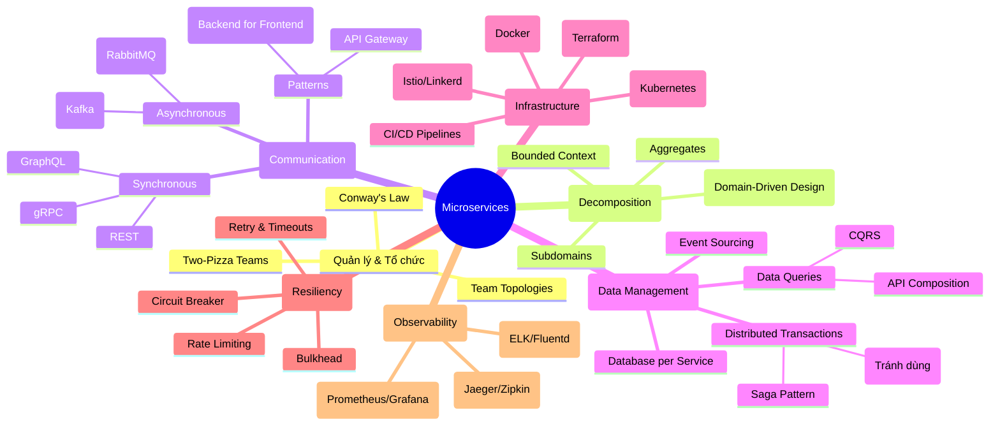
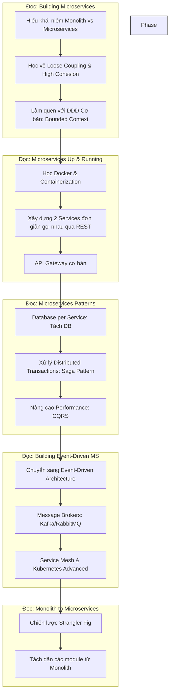

# Hướng Dẫn Nhập Môn Microservice: Tóm Tắt Sách & Lộ Trình Học Tập

Tài liệu này tổng hợp kiến thức từ 6 cuốn sách Microservice hàng đầu, cung cấp một cái nhìn toàn cảnh, Mindmap kết nối các khái niệm và Roadmap học tập chi tiết cho người mới bắt đầu.

## 1. Tóm Tắt Các Cuốn Sách Trong Thư Mục

Dưới đây là tóm tắt nội dung chính và giá trị của từng cuốn sách, giúp bạn chọn tài liệu phù hợp theo từng giai đoạn học tập.

### 1. Building Microservices: Designing Fine-Grained Systems (2nd Edition) - Sam Newman
*   **Chủ đề chính:** Nền tảng, Nguyên lý thiết kế, Con người & Tổ chức.
*   **Tóm tắt:** Đây là cuốn sách "gối đầu giường" cho người mới bắt đầu. Nó giải thích **Microservices là gì** và quan trọng hơn là **Tại sao** nên (hoặc không nên) dùng nó. Sách bao phủ toàn diện từ việc xác định ranh giới dịch vụ (Bounded Contexts), các kiểu giao tiếp, bảo mật, testing đến việc triển khai.
*   **Phù hợp cho:** Người mới bắt đầu muốn hiểu bức tranh toàn cảnh một cách đúng đắn.

### 2. Monolith to Microservices - Sam Newman
*   **Chủ đề chính:** Chiến lược chuyển đổi (Migration Patterns).
*   **Tóm tắt:** Tập trung vào bài toán thực tế nhất: Làm sao để chuyển từ một hệ thống Monolith khổng lồ sang Microservices mà không đập đi xây lại. Sách giới thiệu các pattern quan trọng như **Strangler Fig** (cây sung bóp nghẹt), **Branch by Abstraction**, và cách xử lý cơ sở dữ liệu (chia tách database).
*   **Phù hợp cho:** Kỹ sư đang làm việc với các hệ thống legacy muốn chuyển đổi dần sang Microservices.

### 3. Microservices Patterns: With examples in Java - Chris Richardson
*   **Chủ đề chính:** Các mẫu thiết kế (Design Patterns) cụ thể.
*   **Tóm tắt:** Cuốn sách cực kỳ thực chiến về "Làm thế nào". Nó định nghĩa các vấn đề phổ biến và đưa ra giải pháp qua các pattern như **Saga** (quản lý transaction phân tán), **CQRS**, **Event Sourcing**, **API Gateway**, **Circuit Breaker**. Các ví dụ chủ yếu bằng Java/Spring Boot.
*   **Phù hợp cho:** Senior Developer/Architect cần giải pháp kỹ thuật cụ thể cho các vấn đề phân tán.

### 4. Building Event-Driven Microservices - Adam Bellemare
*   **Chủ đề chính:** Kiến trúc hướng sự kiện (Event-Driven Architecture - EDA).
*   **Tóm tắt:** Đi sâu vào phương pháp giao tiếp bất đồng bộ sử dụng Events (Sự kiện). Sách nói về cấu trúc liên lạc dữ liệu, Kafka, Stream Processing, và cách xây dựng các workflow phức tạp dựa trên sự kiện thay vì gọi hàm trực tiếp (RPC).
*   **Phù hợp cho:** Giai đoạn nâng cao, khi bạn cần hệ thống phản hồi thời gian thực và scale lớn.

### 5. Microservices Up and Running - Ronnie Mitra & Irakli Nadareishvili
*   **Chủ đề chính:** Vận hành, Hạ tầng, Kubernetes.
*   **Tóm tắt:** Hướng dẫn từng bước để đưa Microservices vào vận hành thực tế ("Up and Running"). Sách tập trung vào khía cạnh DevOps: Docker, Kubernetes, CI/CD, Infrastructure as Code. Nó giúp lấp đầy khoảng cách giữa "Code chạy được" và "Hệ thống chạy ổn định".
*   **Phù hợp cho:** DevOps Engineer hoặc Developer muốn hiểu về khâu triển khai và vận hành.

### 6. Microservices in Action - Morgan Bruce & Paulo A. Pereira
*   **Chủ đề chính:** Vòng đời phát triển, Python, Thực hành.
*   **Tóm tắt:** Một hướng dẫn thực hành khác (sử dụng Python) bao trùm vòng đời từ thiết kế, phát triển (SimpleBank example) đến triển khai và giám sát (Monitoring/Logging).
*   **Phù hợp cho:** Developer muốn xem một ví dụ cụ thể từ đầu đến cuối với ngôn ngữ Python.

---

## 2. Mindmap Kiến Thức Microservice

Biểu đồ dưới đây tổng hợp các khái niệm cốt lõi được đề cập trong các cuốn sách trên, giúp bạn hình dung hệ sinh thái Microservice.

---

## 3. Roadmap Học Tập Cho Người Mới (Beginner)

Đối với người mới bắt đầu, việc đọc hết 6 cuốn sách cùng lúc là quá tải. Dưới đây là lộ trình tối ưu để tiếp cận Microservice từ con số 0.

### Chi Tiết Lộ Trình:

1.  **Giai đoạn 1: Nền tảng tư duy (The "Why")**
    *   **Tài liệu:** Đọc *Building Microservices* (Part 1).
    *   **Mục tiêu:** Hiểu rõ Microservice không chỉ là công nghệ mà là tư duy về tổ chức và thiết kế hệ thống. Đừng code vội.
    *   **Key Action:** Vẽ lại kiến trúc hệ thống hiện tại của bạn và xác định các Bounded Context tiềm năng.

2.  **Giai đoạn 2: Bắt tay vào làm (The "Hello World")**
    *   **Tài liệu:** Đọc các chương đầu của *Microservices Up and Running* hoặc *Microservices in Action*.
    *   **Mục tiêu:** Tạo ra 2 services (ví dụ: Order Service và User Service).
    *   **Key Action:**
        *   Viết code 2 services (NodeJS/Python/Go...).
        *   Đóng gói chúng vào Docker.
        *   Dùng Docker Compose để chạy cả 2.
        *   Service A gọi API của Service B.

3.  **Giai đoạn 3: Giải quyết vấn đề dữ liệu (The Hard Part)**
    *   **Tài liệu:** Đọc *Microservices Patterns*.
    *   **Mục tiêu:** Hiểu rằng "Shared Database" là điều cấm kỵ (anti-pattern) trong lâu dài.
    *   **Key Action:**
        *   Tách Database riêng cho Order Service và User Service.
        *   Thực hiện pattern **Saga** để đảm bảo khi tạo Order thì kiểm tra User credit. Nếu lỗi thì rollback.
        *   Thử nghiệm **Circuit Breaker** (ngắt mạch) khi Service B bị chết.

4.  **Giai đoạn 4: Hướng sự kiện (Async & Events)**
    *   **Tài liệu:** Đọc *Building Event-Driven Microservices*.
    *   **Mục tiêu:** Chuyển từ gọi REST (đồng bộ) sang bắn Event (bất đồng bộ) để giảm sự phụ thuộc.
    *   **Key Action:**
        *   Tích hợp RabbitMQ hoặc Kafka.
        *   User Service bắn event `UserCreated`, Email Service hứng event này để gửi mail chào mừng.

5.  **Giai đoạn 5: Vận hành & Di cư (Production & Migration)**
    *   **Tài liệu:** Đọc *Monolith to Microservices*.
    *   **Mục tiêu:** Nếu bạn đang có dự án cũ, hãy bắt đầu di cư nó.
    *   **Key Action:**
        *   Áp dụng **Strangler Fig Pattern**: Xây dựng tính năng mới dưới dạng Microservice, giữ nguyên phần cũ, dùng Gateway điều hướng.
        *   Học Kubernetes để quản lý hàng chục services.

---
*Tổng hợp bởi Antigravity Agent*
