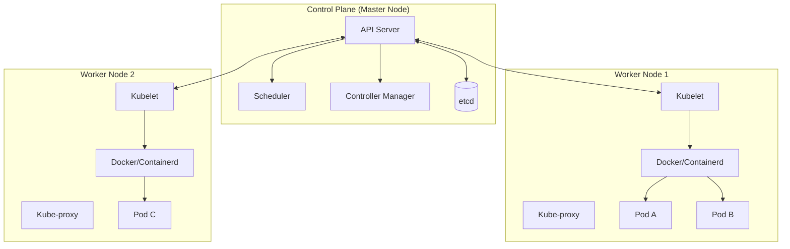

# Kubernetes (K8s) Là Gì? Hướng Dẫn Tổng Quan & Kiến Trúc

> **Tóm tắt:** Tài liệu này giải thích Kubernetes là gì, tại sao nó lại quan trọng trong thế giới cloud-native, kiến trúc chi tiết (Control Plane, Worker Nodes) và các khái niệm cốt lõi cần biết.

---

## Mục Lục
1. [Kubernetes Là Gì?](#1-kubernetes-là-gì)
2. [Tại Sao Cần Kubernetes?](#2-tại-sao-cần-kubernetes)
3. [Kiến Trúc Tổng Quan](#3-kiến-trúc-tổng-quan)
4. [Các Thành Phần Chi Tiết](#4-các-thành-phần-chi-tiết)
5. [Các Khái Niệm Cốt Lõi (Core Concepts)](#5-các-khái-niệm-cốt-lõi-core-concepts)
6. [Lợi Ích Của Kubernetes](#6-lợi-ích-của-kubernetes)
7. [Kết Luận](#7-kết-luận)

---

## 1. Kubernetes Là Gì?

**Kubernetes** (thường viết tắt là **K8s**) là một nền tảng mã nguồn mở (open-source) dùng để **tự động hóa việc triển khai (deployment), mở rộng (scaling) và quản lý (management)** các ứng dụng container hóa (containerized applications).

Tên gọi Kubernetes bắt nguồn từ tiếng Hy Lạp, có nghĩa là "thuyền trưởng" hoặc "người lái tàu". Nó được Google thiết kế ban đầu và hiện được duy trì bởi Cloud Native Computing Foundation (CNCF).

> **Hiểu đơn giản:** Nếu Container (Docker) là các "kiện hàng", thì Kubernetes là "hệ thống cần cẩu và quản lý cảng biển" để sắp xếp, vận chuyển và đảm bảo các kiện hàng đó luôn đến đúng nơi, đúng lúc.

---

## 2. Tại Sao Cần Kubernetes?

Trong kỷ nguyên của Microservices và Container:
*   Bạn có thể quản lý 2-3 container bằng tay (docker run).
*   Nhưng khi hệ thống lớn lên **hàng trăm/ngàn container**, việc quản lý thủ công là bất khả thi.

**Vấn đề gặp phải:**
1.  Container bị chết (crash) -> Ai sẽ khởi động lại?
2.  Server vật lý bị hỏng -> Ai sẽ di chuyển container sang server khác?
3.  Traffic tăng đột biến -> Ai sẽ tạo thêm container để chịu tải?

=> **Kubernetes sinh ra để giải quyết tất cả các vấn đề này một cách tự động (Orchestration).**

---

## 3. Kiến Trúc Tổng Quan

Một **Cluster** Kubernetes bao gồm ít nhất một **Control Plane** (Master Node) và một hoặc nhiều **Worker Nodes**.

---

## 4. Các Thành Phần Chi Tiết

### 4.1. Control Plane (Bộ não của hệ thống)
Chịu trách nhiệm quản lý trạng thái của Cluster.
1.  **kube-apiserver:** Cổng giao tiếp chính. Mọi yêu cầu (từ user qua `kubectl` hoặc từ các node) đều phải đi qua đây.
2.  **etcd:** Kho lưu trữ key-value phân tán, lưu giữ **TOÀN BỘ** dữ liệu cấu hình và trạng thái của cluster. Đây là "chân lý" duy nhất của hệ thống.
3.  **kube-scheduler:** Quyết định xem một Pod mới sẽ được chạy trên Node nào (dựa trên resources CPU/RAM còn trống).
4.  **kube-controller-manager:** Các vòng lặp kiểm soát (control loops) để đảm bảo trạng thái thực tế khớp với trạng thái mong muốn (vd: Node controller, Replication controller).

### 4.2. Worker Nodes (Nơi ứng dụng chạy)
Máy chủ (vật lý hoặc ảo) nơi các container thực sự hoạt động.
1.  **kubelet:** "Thuyền trưởng" của node. Nó giao tiếp với API Server để nhận lệnh và quản lý các Pod trên node đó.
2.  **kube-proxy:** Quản lý network rule, giúp các Pod có thể giao tiếp với nhau và với bên ngoài.
3.  **Container Runtime:** Phần mềm chạy container (Docker, containerd, CRI-O).

---

## 5. Các Khái Niệm Cốt Lõi (Core Concepts)

### 5.1. Pod
Đơn vị nhỏ nhất trong K8s. Một Pod bọc một hoặc nhiều container (thường là 1). Các container trong cùng Pod chia sẻ Network và Storage.
> *Nguyên tắc:* "One process per container", nhưng "Multiple containers per Pod" nếu chúng bổ trợ chặt chẽ cho nhau (sidecar pattern).

### 5.2. Service
Một lớp trừu tượng mạng (network abstraction) giúp định danh một nhóm các Pod.
*   Pod có thể chết và sinh ra với IP mới.
*   **Service** cung cấp một IP tĩnh và DNS name ổn định để các thành phần khác gọi tới nhóm Pod đó.

### 5.3. Namespace
Dùng để chia một Cluster vật lý thành nhiều "Cluster ảo".
*   Ví dụ: `dev`, `staging`, `prod`. Giúp quản lý resource và access control (RBAC) tốt hơn.

### 5.4. Deployment
Định nghĩa cách ứng dụng được triển khai và cập nhật.
*   Bạn mô tả: "Tôi muốn chạy 3 bản sao (replicas) của app nginx".
*   Deployment sẽ đảm bảo luôn có đúng 3 Pod chạy.
*   Hỗ trợ **Rolling Update** và **Rollback** version dễ dàng.

### 5.5. ConfigMap & Secret
*   **ConfigMap:** Lưu cấu hình không nhạy cảm (biến môi trường, file config).
*   **Secret:** Lưu dữ liệu nhạy cảm (password, key) dưới dạng base64.

---

## 6. Lợi Ích Của Kubernetes

| Lợi ích | Mô tả |
| :--- | :--- |
| **Self-healing** | Tự động restart container bị lỗi, thay thế container, kill container không phản hồi health check. |
| **Auto-scaling** | Tự động tăng/giảm số lượng Pod (HPA) hoặc Node (Cluster Autoscaler) dựa trên tải CPU/RAM. |
| **Load Balancing** | Tự động phân phối traffic đều giữa các container. |
| **Automated Rollouts** | Cập nhật phiên bản mới cho ứng dụng mà không gây downtime (Rolling update). |
| **Infrastructure Agnostic** | Chạy được trên mọi nơi: On-premise, AWS, Google Cloud, Azure, hay Local laptop. |

---

## 7. Kết Luận

**Kubernetes** hiện nay là tiêu chuẩn vàng (de facto standard) cho việc vận hành các ứng dụng phân tán hiện đại. Mặc dù có đường cong học tập (learning curve) khá dốc, nhưng những lợi ích về khả năng mở rộng, độ tin cậy và tự động hóa mà nó mang lại là vô giá cho các hệ thống lớn.

> **Bước tiếp theo:** Để làm chủ K8s, bạn nên bắt đầu thực hành với **Minikube** hoặc **Kind** (Kubernetes in Docker) ngay trên máy cá nhân.
