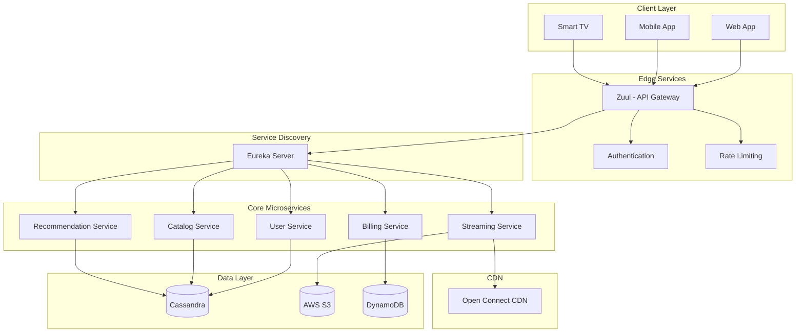
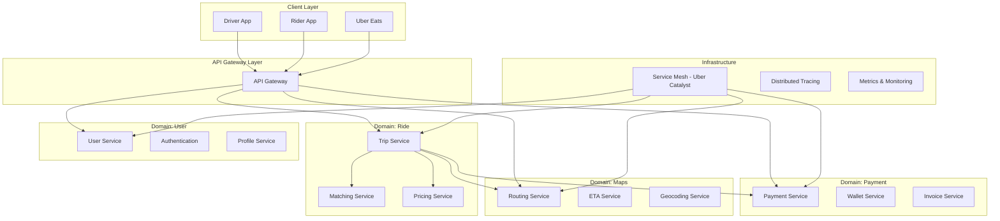
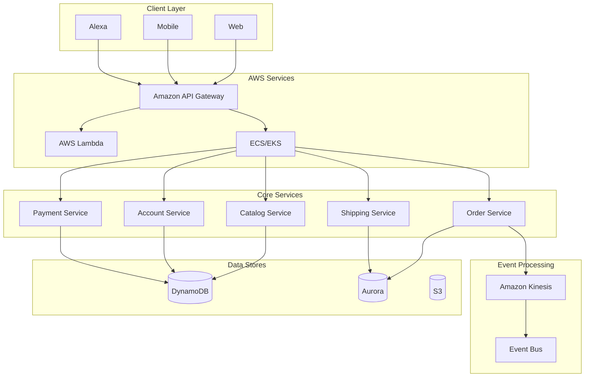
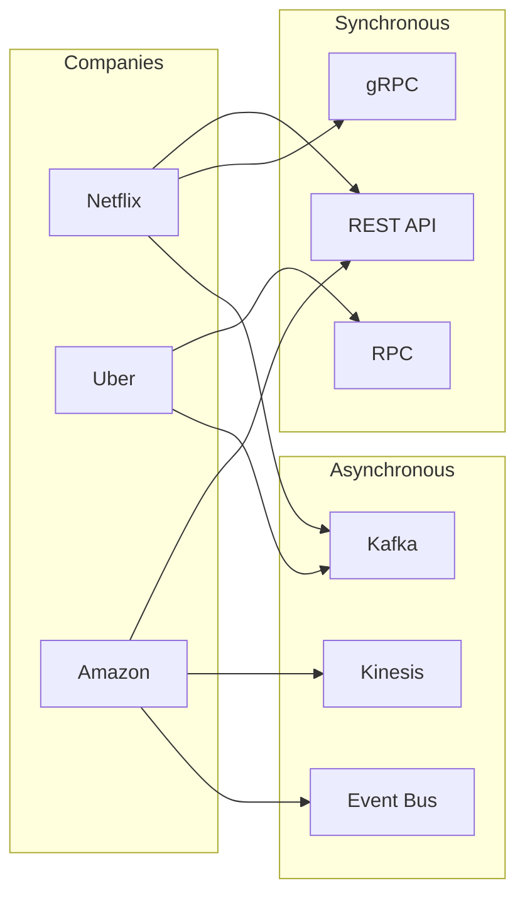
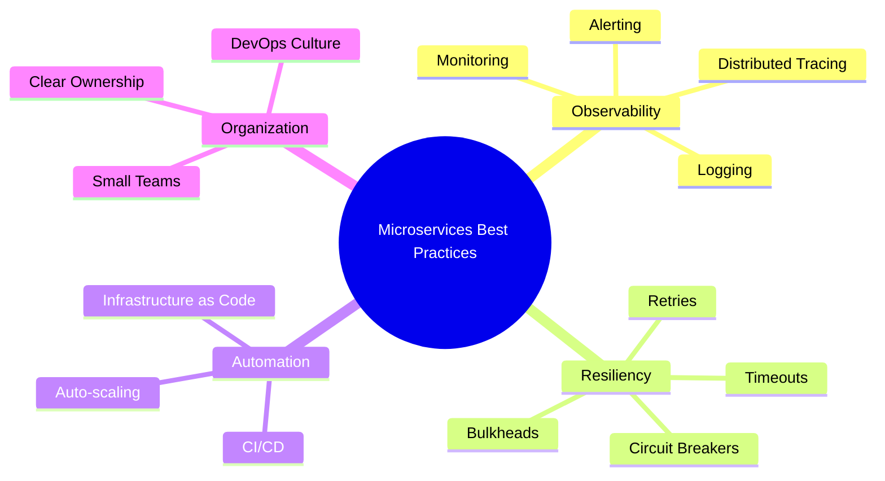
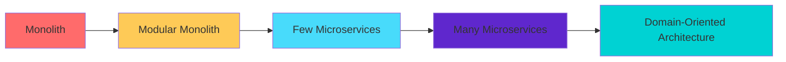

# Phân Tích Kiến Trúc Microservices: Uber, Netflix & Amazon

> **Ngày phân tích:** 26/12/2024  
> **Nguồn:** Nghiên cứu từ các bài viết kỹ thuật, blog chính thức và tài liệu của các công ty

---

## 1. Tổng Quan

Cả **Uber**, **Netflix** và **Amazon** đều bắt đầu với kiến trúc **Monolithic** và sau đó chuyển sang **Microservices** để giải quyết các vấn đề về:
- Khả năng mở rộng (Scalability)
- Bottleneck trong triển khai
- Khó khăn trong việc bảo trì codebase lớn
- Sự phối hợp giữa các team

---

## 2. Kiến Trúc Microservices của Netflix

### 2.1. Thông Số Quy Mô
| Chỉ số | Giá trị |
|--------|---------|
| Số lượng microservices | **700+** |
| API calls/ngày | **15+ tỷ** |
| Container deployments/tuần | **1+ triệu** |
| Bắt đầu chuyển đổi | 2008-2009 |
| Hoàn thành chuyển đổi | 2016 |

### 2.2. Kiến Trúc Tổng Quan

### 2.3. Các Thành Phần Chính

#### API Gateway - Zuul
- **Chức năng:** Điểm vào duy nhất cho tất cả request từ client
- **Nhiệm vụ:** Routing, Authentication, Authorization, Rate Limiting
- **Công nghệ:** Netflix tự phát triển, đã open-source

#### Service Discovery - Eureka
- **Chức năng:** Đăng ký và khám phá service động
- **Cách hoạt động:** Services đăng ký với Eureka server, các service khác có thể tìm thấy nhau mà không cần hardcode địa chỉ

#### Circuit Breaker - Hystrix
- **Chức năng:** Bảo vệ hệ thống khỏi cascading failures
- **Pattern:** Khi service gặp lỗi, Hystrix sẽ "mở circuit" và trả về fallback response
- **Lưu ý:** Hystrix hiện đã ở chế độ maintenance, nhưng concept được áp dụng rộng rãi

#### Content Delivery - Open Connect
- **Chức năng:** CDN độc quyền của Netflix
- **Đặc điểm:** Cache content gần với end-users để giảm latency

### 2.4. Technology Stack

| Layer | Technologies |
|-------|--------------|
| **Backend** | Spring Boot (Java), Node.js, Python, Golang |
| **API** | GraphQL Federation, gRPC |
| **Event Streaming** | Apache Kafka |
| **Database** | Cassandra, AWS S3, DynamoDB |
| **Deployment** | Spinnaker |
| **Cloud** | AWS (EC2, S3, DynamoDB) |

### 2.5. Nguyên Tắc Thiết Kế

1. **Database per Service:** Mỗi microservice quản lý data store riêng
2. **Eventual Consistency:** Chấp nhận dữ liệu có thể không đồng bộ ngay lập tức
3. **Event-Driven Architecture:** Sử dụng events để giao tiếp giữa services
4. **Chaos Engineering:** Sử dụng Chaos Monkey để test resilience

---

## 3. Kiến Trúc Microservices của Uber

### 3.1. Thông Số Quy Mô

| Chỉ số | Giá trị |
|--------|---------|
| Số lượng microservices (2019) | **2,200+** |
| Số lượng microservices (2023) | **4,500+** |
| Bắt đầu với | Python + PostgreSQL |
| Kiến trúc mới | DOMA (Domain-Oriented Microservice Architecture) |

### 3.2. Kiến Trúc Tổng Quan - DOMA

### 3.3. DOMA - Domain-Oriented Microservice Architecture

> [!IMPORTANT]
> DOMA là phương pháp Uber sử dụng để quản lý hàng nghìn microservices bằng cách nhóm chúng theo domain nghiệp vụ.

**Nguyên tắc chính:**
- **Domain Grouping:** Services được nhóm theo business domain
- **Clear Ownership:** Mỗi domain có team sở hữu rõ ràng
- **Service Boundaries:** Ranh giới rõ ràng giữa các domains
- **Reduced Coupling:** Giảm thiểu phụ thuộc không cần thiết giữa domains

### 3.4. Các Thành Phần Chính

#### Service Mesh - Uber Catalyst
- **Chức năng:** Quản lý giao tiếp service-to-service
- **Đặc điểm:** Tự phát triển, tối ưu cho quy mô Uber

#### Communication - TChannel over Hyperbahn
- **Chức năng:** Service discovery và inter-service communication
- **Protocol:** RPC (Remote Procedure Call)

#### Deployment - µDeploy
- **Chức năng:** Triển khai code tập trung ở quy mô lớn
- **Đặc điểm:** Hỗ trợ triển khai độc lập cho từng service

### 3.5. Challenges và Solutions

| Challenge | Solution |
|-----------|----------|
| Microservice sprawl | DOMA - Nhóm theo domain |
| Tangled dependencies | Service boundaries rõ ràng |
| Inconsistent APIs | Standardized communication patterns |
| Cognitive overload | Clear ownership per domain |

---

## 4. Kiến Trúc Microservices của Amazon

### 4.1. Đặc Điểm Nổi Bật

- **Tiên phong** trong việc áp dụng microservices
- **"Two-Pizza Teams":** Nhóm nhỏ, tự chủ (6-10 người)
- **API-First Design:** Mọi chức năng được wrap trong APIs

### 4.2. Kiến Trúc Tổng Quan

### 4.3. AWS Services cho Microservices

| Service | Chức năng |
|---------|-----------|
| **API Gateway** | Front door cho microservices |
| **Lambda** | Serverless functions |
| **ECS/EKS** | Container orchestration |
| **Fargate** | Serverless containers |
| **Kinesis** | Event streaming |
| **CodePipeline** | Automated deployment |

---

## 5. So Sánh Kiến Trúc

### 5.1. Bảng So Sánh Tổng Quan

| Tiêu chí | Netflix | Uber | Amazon |
|----------|---------|------|--------|
| **Số services** | 700+ | 4,500+ | N/A (hàng nghìn) |
| **API Gateway** | Zuul | Custom Gateway | Amazon API Gateway |
| **Service Discovery** | Eureka | Hyperbahn | AWS Service Discovery |
| **Circuit Breaker** | Hystrix | Custom | AWS App Mesh |
| **Service Mesh** | N/A | Uber Catalyst | AWS App Mesh |
| **Event Streaming** | Kafka | Kafka | Amazon Kinesis |
| **Deployment** | Spinnaker | µDeploy | CodePipeline |
| **Cloud** | AWS | Multi-cloud | AWS |
| **Organizational Pattern** | Full-cycle teams | DOMA | Two-Pizza Teams |

### 5.2. Communication Patterns

---

## 6. Best Practices Chung

### 6.1. Architectural Patterns

| Pattern | Mô tả | Áp dụng bởi |
|---------|-------|-------------|
| **Database per Service** | Mỗi service có database riêng | Netflix, Uber, Amazon |
| **API Gateway** | Single entry point | Tất cả |
| **Service Discovery** | Dynamic service registration | Tất cả |
| **Circuit Breaker** | Prevent cascading failures | Netflix, Uber |
| **Event-Driven** | Asynchronous communication | Tất cả |
| **CQRS** | Tách read và write | Netflix |
| **Saga Pattern** | Distributed transactions | Amazon |

### 6.2. Operational Practices

### 6.3. Nguyên Tắc Thiết Kế

1. **Single Responsibility:** Mỗi service làm một việc và làm tốt
2. **Loose Coupling:** Giảm thiểu dependencies giữa services
3. **High Cohesion:** Code liên quan nằm cùng nhau
4. **Design for Failure:** Hệ thống phải hoạt động khi có lỗi
5. **Automate Everything:** Từ deployment đến testing

---

## 7. Lessons Learned

### 7.1. Từ Netflix

> [!TIP]
> - **Chaos Engineering:** Test resilience bằng cách cố tình gây lỗi trong production
> - **Full-cycle Development:** Teams sở hữu service từ development đến operations
> - **Open Source:** Chia sẻ tools (Zuul, Eureka, Hystrix) với cộng đồng

### 7.2. Từ Uber

> [!TIP]
> - **DOMA:** Quản lý complexity bằng domain-oriented organization
> - **Standardization:** Chuẩn hóa patterns và communication protocols
> - **Observability First:** Đầu tư mạnh vào distributed tracing

### 7.3. Từ Amazon

> [!TIP]
> - **Two-Pizza Teams:** Team nhỏ, tự chủ, quyết định nhanh
> - **API-First:** Mọi thứ là service, giao tiếp qua API
> - **Eat Your Own Dog Food:** Sử dụng AWS services cho chính mình

---

## 8. Kết Luận

### 8.1. Khi Nào Nên Dùng Microservices

| Nên dùng khi | Không nên dùng khi |
|--------------|-------------------|
| Hệ thống lớn, phức tạp | Ứng dụng nhỏ, đơn giản |
| Team lớn, phân tán | Team nhỏ, tập trung |
| Cần scale độc lập | Yêu cầu strong consistency |
| Deploy thường xuyên | Resource hạn chế |

### 8.2. Lộ Trình Áp Dụng

> [!CAUTION]
> **Microservices không phải silver bullet!** Chúng giải quyết vấn đề về scale nhưng tạo ra complexity mới. Hãy bắt đầu đơn giản và evolve dần dần.

---

## 9. Tài Liệu Tham Khảo

### Nguồn chính thức
- [Netflix Tech Blog](https://netflixtechblog.com/)
- [Uber Engineering Blog](https://eng.uber.com/)
- [AWS Architecture Blog](https://aws.amazon.com/blogs/architecture/)

### Công cụ Open Source
- Zuul (Netflix API Gateway)
- Eureka (Netflix Service Discovery)
- Hystrix (Netflix Circuit Breaker)
- Spinnaker (Netflix Continuous Delivery)

---

> **Lưu ý:** MCP Server "Tailivy" không khả dụng trong hệ thống. Báo cáo này được tạo dựa trên nghiên cứu từ web search.
