# Phân Tích Chi Tiết Các Layers Trong Kiến Trúc Microservice Của Netflix

> **Ngày tạo:** 26/12/2024  
> **Tham khảo từ:** microservices_architecture_analysis.md và các nguồn nghiên cứu bổ sung

---

## Mục Lục

1. [Tổng Quan Kiến Trúc](#1-tổng-quan-kiến-trúc)
2. [Layer 1: Client Layer](#2-layer-1-client-layer)
3. [Layer 2: Edge Services Layer](#3-layer-2-edge-services-layer)
4. [Layer 3: Service Discovery & Orchestration Layer](#4-layer-3-service-discovery--orchestration-layer)
5. [Layer 4: Core Microservices Layer](#5-layer-4-core-microservices-layer)
6. [Layer 5: Data Layer](#6-layer-5-data-layer)
7. [Layer 6: Content Delivery Network (CDN) Layer](#7-layer-6-content-delivery-network-cdn-layer)
8. [Layer 7: Infrastructure & Observability Layer](#8-layer-7-infrastructure--observability-layer)
9. [Luồng Dữ Liệu Giữa Các Layers](#9-luồng-dữ-liệu-giữa-các-layers)
10. [Tổng Kết](#10-tổng-kết)

---

## 1. Tổng Quan Kiến Trúc

Netflix sử dụng kiến trúc microservices với hơn **700+ services** xử lý **15+ tỷ API calls/ngày**. Kiến trúc này được chia thành 7 layers chính:

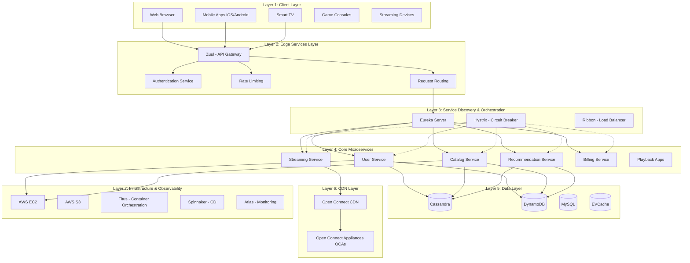
```mermaid
graph TB
    subgraph "Layer 1: Client Layer"
        C1[Web Browser]
        C2[Mobile Apps iOS/Android]
        C3[Smart TV]
        C4[Game Consoles]
        C5[Streaming Devices]
    end

    subgraph "Layer 2: Edge Services Layer"
        E1[Zuul - API Gateway]
        E2[Authentication Service]
        E3[Rate Limiting]
        E4[Request Routing]
    end

    subgraph "Layer 3: Service Discovery & Orchestration"
        S1[Eureka Server]
        S2[Hystrix - Circuit Breaker]
        S3[Ribbon - Load Balancer]
    end

    subgraph "Layer 4: Core Microservices"
        M1[User Service]
        M2[Catalog Service]
        M3[Recommendation Service]
        M4[Streaming Service]
        M5[Billing Service]
        M6[Playback Apps]
    end

    subgraph "Layer 5: Data Layer"
        D1[(Cassandra)]
        D2[(DynamoDB)]
        D3[(MySQL)]
        D4[(EVCache)]
    end

    subgraph "Layer 6: CDN Layer"
        CDN1[Open Connect CDN]
        CDN2[Open Connect Appliances OCAs]
    end

    subgraph "Layer 7: Infrastructure & Observability"
        I1[AWS EC2]
        I2[AWS S3]
        I3[Titus - Container Orchestration]
        I4[Spinnaker - CD]
        I5[Atlas - Monitoring]
    end

    C1 & C2 & C3 --> E1
    E1 --> E2 & E3 & E4
    E4 --> S1
    S1 --> M1 & M2 & M3 & M4 & M5
    S2 -.-> M1 & M2 & M3 & M4 & M5
    M1 & M2 & M3 --> D1 & D2
    M4 --> CDN1
    CDN1 --> CDN2
    M1 & M2 --> I1
```

---

## 2. Layer 1: Client Layer

### 2.1. Mô Tả

Client Layer là điểm tiếp xúc đầu tiên với người dùng. Netflix hỗ trợ hơn **2000+ loại thiết bị** khác nhau.

### 2.2. Các Thành Phần

| Platform | Công nghệ | Đặc điểm |
|----------|-----------|----------|
| **Web Browser** | React.js, Node.js | Single Page Application, Adaptive streaming |
| **Mobile iOS** | Swift, Objective-C | Native app với offline download |
| **Mobile Android** | Kotlin, Java | Native app với adaptive bitrate |
| **Smart TV** | Various SDKs | Platform-specific implementations |
| **Game Consoles** | Platform SDKs | Xbox, PlayStation integration |
| **Streaming Devices** | Embedded systems | Roku, Fire TV, Chromecast |

### 2.3. Chức Năng Chính

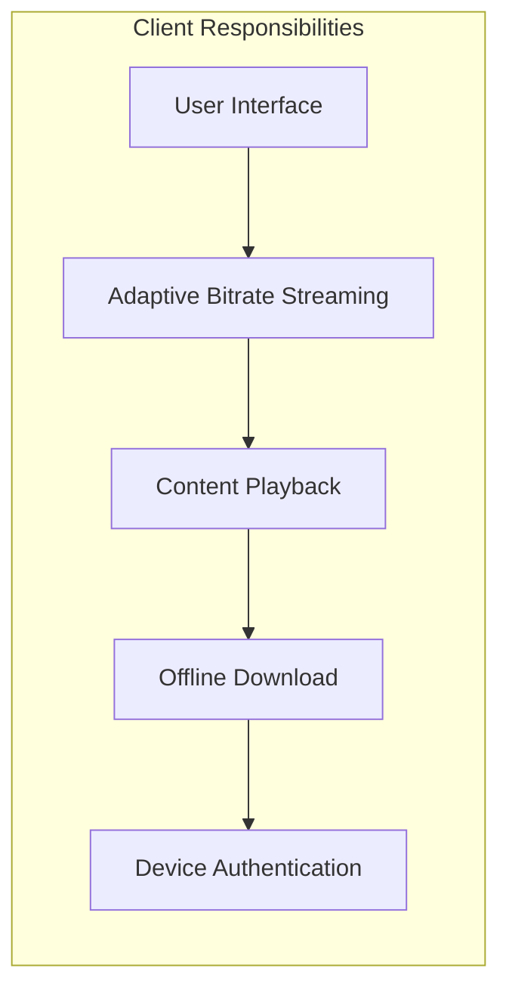
```mermaid
flowchart LR
    subgraph "Client Responsibilities"
        A[User Interface] --> B[Adaptive Bitrate Streaming]
        B --> C[Content Playback]
        C --> D[Offline Download]
        D --> E[Device Authentication]
    end
```

1. **Adaptive Bitrate Streaming (ABR):** Client tự động chọn chất lượng video phù hợp với băng thông hiện tại
2. **Content Caching:** Lưu trữ metadata và thumbnails để tối ưu hiệu suất
3. **User Interaction:** Thu thập dữ liệu hành vi người dùng (viewing patterns, preferences)
4. **Playback Control:** Điều khiển play, pause, seek, và quality selection

### 2.4. Best Practices

> [!TIP]
> - **Responsive Design:** UI thích ứng với mọi kích thước màn hình
> - **Progressive Loading:** Load nội dung từng phần để cải thiện perceived performance
> - **Error Handling:** Xử lý gracefully các lỗi network và playback

---

## 3. Layer 2: Edge Services Layer

### 3.1. Mô Tả

Edge Services Layer là "cổng vào" của toàn bộ hệ thống Netflix, xử lý tất cả request từ clients trước khi chuyển đến các backend services.

### 3.2. Zuul - API Gateway

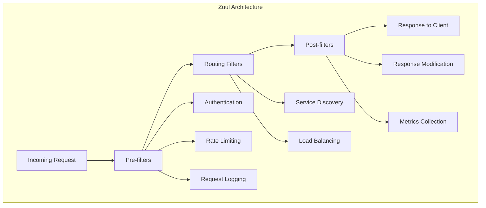
```mermaid
flowchart TD
    subgraph "Zuul Architecture"
        A[Incoming Request] --> B[Pre-filters]
        B --> C[Routing Filters]
        C --> D[Post-filters]
        D --> E[Response to Client]
        
        B --> F[Authentication]
        B --> G[Rate Limiting]
        B --> H[Request Logging]
        
        C --> I[Service Discovery]
        C --> J[Load Balancing]
        
        D --> K[Response Modification]
        D --> L[Metrics Collection]
    end
```

#### 3.2.1. Các Loại Filters

| Filter Type | Thời điểm thực thi | Chức năng |
|-------------|-------------------|-----------|
| **Pre-filters** | Trước routing | Authentication, rate limiting, request logging |
| **Routing filters** | Khi routing | Service discovery, load balancing |
| **Post-filters** | Sau khi nhận response | Response modification, metrics |
| **Error filters** | Khi có lỗi | Error handling, fallback responses |

#### 3.2.2. Zuul 2 vs Zuul 1

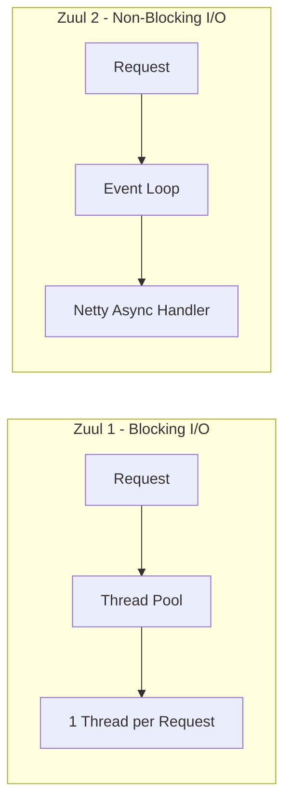
```mermaid
graph LR
    subgraph "Zuul 1 - Blocking I/O"
        Z1A[Request] --> Z1B[Thread Pool]
        Z1B --> Z1C[1 Thread per Request]
    end
    
    subgraph "Zuul 2 - Non-Blocking I/O"
        Z2A[Request] --> Z2B[Event Loop]
        Z2B --> Z2C[Netty Async Handler]
    end
```

| Feature | Zuul 1 | Zuul 2 |
|---------|--------|--------|
| **I/O Model** | Blocking (Servlet) | Non-blocking (Netty) |
| **Throughput** | ~1000 RPS | ~10,000+ RPS |
| **Memory** | Higher | Lower |
| **Connections** | Thread-bound | Connection pooling |

### Tại sao lại có 2 phiên bản Zuul? (Giải thích chi tiết)

Việc Netflix phát triển và chuyển đổi từ **Zuul 1** sang **Zuul 2** là để giải quyết bài toán về **Hiệu năng (Performance)** và **Khả năng mở rộng (Scalability)**.

**1. Vấn đề của Zuul 1 (Blocking I/O)**
Zuul 1 được xây dựng dựa trên **Servlet API** cũ, sử dụng mô hình **Blocking I/O**.
*   **Cơ chế:** Mỗi request từ người dùng sẽ chiếm dụng (block) một thread (luồng) riêng biệt của server cho đến khi xử lý xong (bao gồm cả thời gian chờ backend service trả lời).
*   **Hạn chế:** Nếu backend xử lý chậm hoặc mạng lag, thread đó bị treo. Khi số lượng request quá lớn (hàng triệu RPM), server sẽ hết sạch thread pool để phục vụ request mới -> **Nghẽn cổ chai**.
*   **Hiệu năng:** Chỉ xử lý được khoảng **~1,000 RPS** (Request Per Second) trên một node.

**2. Giải pháp của Zuul 2 (Non-Blocking I/O)**
Zuul 2 được viết lại hoàn toàn dựa trên **Netty**, sử dụng mô hình **Non-blocking / Async I/O**.
*   **Cơ chế:** Sử dụng một số ít thread (Event Loop) để nhận request. Khi cần gọi backend, nó gửi tín hiệu rồi giải phóng thread đi làm việc khác. Khi backend trả lời, nó sẽ "gọi lại" (callback) để xử lý tiếp.
*   **Lợi ích:** Một thread có thể xử lý hàng nghìn kết nối đồng thời (tương tự như cách Node.js hay Nginx hoạt động).
*   **Kết nối dài:** Hỗ trợ tốt hơn cho **Persistent Connections** (WebSockets, SSE) và các thiết bị di động có kết nối chập chờn.
*   **Hiệu năng:** Tăng vọt lên **~10,000+ RPS** trên một node (gấp 10 lần Zuul 1).

### 3.3. Authentication Service

Xử lý xác thực và phân quyền cho tất cả requests:

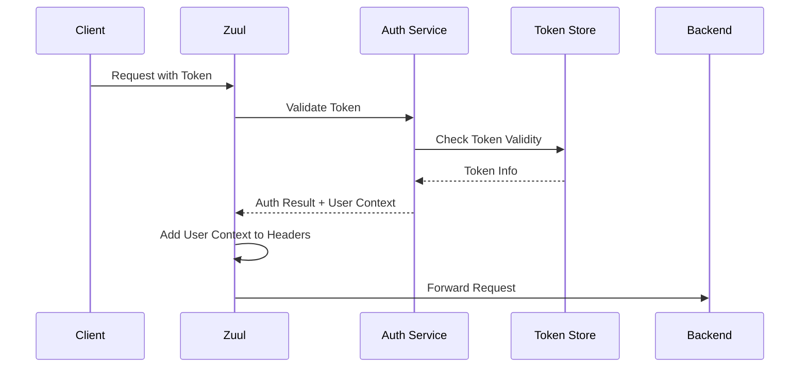
```mermaid
sequenceDiagram
    participant C as Client
    participant Z as Zuul
    participant A as Auth Service
    participant T as Token Store
    
    C->>Z: Request with Token
    Z->>A: Validate Token
    A->>T: Check Token Validity
    T-->>A: Token Info
    A-->>Z: Auth Result + User Context
    Z->>Z: Add User Context to Headers
    Z->>Backend: Forward Request
```

### 3.4. Rate Limiting

Netflix sử dụng nhiều chiến lược rate limiting:

| Strategy | Mô tả | Use Case |
|----------|-------|----------|
| **Token Bucket** | Giới hạn số request trong time window | API protection |
| **Leaky Bucket** | Làm mượt traffic bursts | Video streaming |
| **Sliding Window** | Rate limit chính xác theo thời gian thực | High-precision limiting |

> [!IMPORTANT]
> Rate limiting được áp dụng theo nhiều dimensions: per-user, per-device, per-API endpoint, và per-region.

---

## 4. Layer 3: Service Discovery & Orchestration Layer

### 4.1. Eureka - Service Discovery

#### 4.1.1. Kiến Trúc Eureka

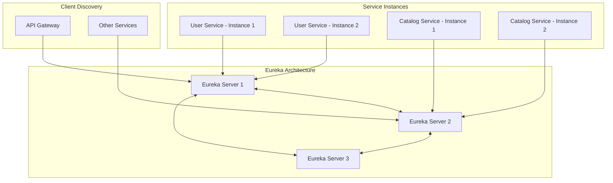
```mermaid
graph TB
    subgraph "Eureka Architecture"
        ES1[Eureka Server 1]
        ES2[Eureka Server 2]
        ES3[Eureka Server 3]
        
        ES1 <--> ES2
        ES2 <--> ES3
        ES1 <--> ES3
    end
    
    subgraph "Service Instances"
        S1A[User Service - Instance 1]
        S1B[User Service - Instance 2]
        S2A[Catalog Service - Instance 1]
        S2B[Catalog Service - Instance 2]
    end
    
    S1A & S1B --> ES1
    S2A & S2B --> ES2
    
    subgraph "Client Discovery"
        C1[API Gateway]
        C2[Other Services]
    end
    
    C1 --> ES1
    C2 --> ES2
```

#### 4.1.2. Registration Process

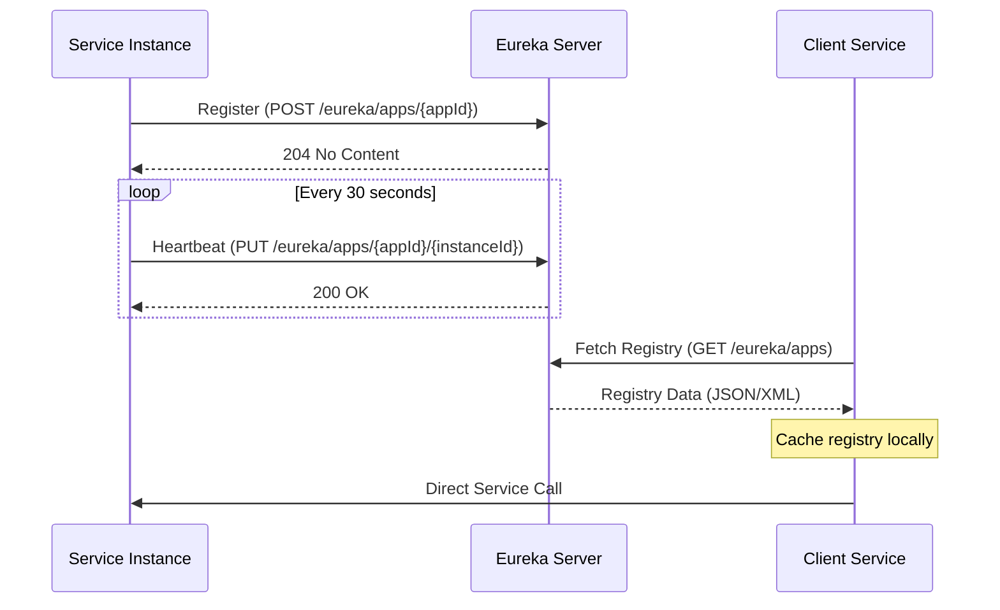
```mermaid
sequenceDiagram
    participant S as Service Instance
    participant E as Eureka Server
    participant C as Client Service
    
    S->>E: Register (POST /eureka/apps/{appId})
    E-->>S: 204 No Content
    
    loop Every 30 seconds
        S->>E: Heartbeat (PUT /eureka/apps/{appId}/{instanceId})
        E-->>S: 200 OK
    end
    
    C->>E: Fetch Registry (GET /eureka/apps)
    E-->>C: Registry Data (JSON/XML)
    
    Note over C: Cache registry locally
    
    C->>S: Direct Service Call
```

#### 4.1.3. Key Features

| Feature | Mô tả |
|---------|-------|
| **Self-Preservation Mode** | Tránh deregistration khi có network issues |
| **Client-side Caching** | Giảm load lên Eureka server |
| **Zone Awareness** | Ưu tiên gọi services trong cùng zone |
| **Peer Replication** | Đồng bộ registry giữa các Eureka servers |

### 4.2. Hystrix - Circuit Breaker

#### 4.2.1. Circuit Breaker States

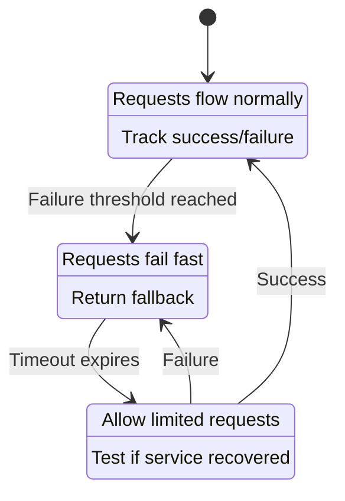
```mermaid
stateDiagram-v2
    [*] --> Closed
    Closed --> Open : Failure threshold reached
    Open --> HalfOpen : Timeout expires
    HalfOpen --> Closed : Success
    HalfOpen --> Open : Failure
    
    Closed : Requests flow normally
    Closed : Track success/failure
    
    Open : Requests fail fast
    Open : Return fallback
    
    HalfOpen : Allow limited requests
    HalfOpen : Test if service recovered
```

#### 4.2.2. Hystrix Configuration

```java
// Example Hystrix Command Configuration
@HystrixCommand(
    fallbackMethod = "getDefaultRecommendations",
    commandProperties = {
        @HystrixProperty(name = "circuitBreaker.requestVolumeThreshold", value = "20"),
        @HystrixProperty(name = "circuitBreaker.errorThresholdPercentage", value = "50"),
        @HystrixProperty(name = "circuitBreaker.sleepWindowInMilliseconds", value = "5000"),
        @HystrixProperty(name = "execution.isolation.thread.timeoutInMilliseconds", value = "1000")
    }
)
public List<Video> getRecommendations(String userId) {
    return recommendationService.getRecommendations(userId);
}

public List<Video> getDefaultRecommendations(String userId) {
    return cachedRecommendations.getPopularVideos();
}
```

#### 4.2.3. Hystrix Patterns

| Pattern | Mô tả | Benefit |
|---------|-------|---------|
| **Fallback** | Trả về response mặc định khi service fail | Graceful degradation |
| **Bulkhead** | Isolated thread pools per service | Failure isolation |
| **Timeout** | Giới hạn thời gian chờ response | Prevent blocking |
| **Request Caching** | Cache identical requests | Reduce load |

> [!WARNING]
> **Lưu ý:** Hystrix đã được đưa vào maintenance mode từ 2018. Netflix khuyến khích sử dụng **Resilience4j** cho các dự án mới.

### 4.3. Ribbon - Client-Side Load Balancing

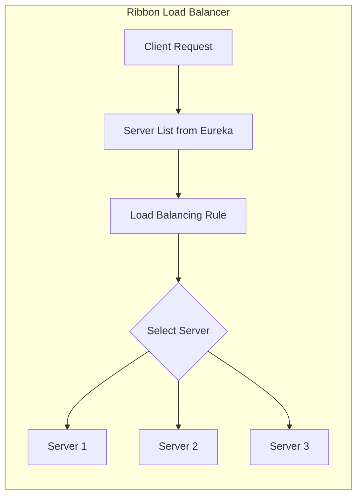
```mermaid
flowchart LR
    subgraph "Ribbon Load Balancer"
        A[Client Request] --> B[Server List from Eureka]
        B --> C[Load Balancing Rule]
        C --> D{Select Server}
        D --> E[Server 1]
        D --> F[Server 2]
        D --> G[Server 3]
    end
```

#### Load Balancing Strategies

| Strategy | Mô tả |
|----------|-------|
| **RoundRobinRule** | Luân phiên giữa các servers |
| **RandomRule** | Chọn ngẫu nhiên |
| **WeightedResponseTimeRule** | Ưu tiên server có response time thấp |
| **AvailabilityFilteringRule** | Loại bỏ servers không khả dụng |
| **ZoneAvoidanceRule** | Ưu tiên servers cùng zone |

---

## 5. Layer 4: Core Microservices Layer

### 5.1. Tổng Quan

Core Microservices Layer chứa các business logic services chính của Netflix. Mỗi service được thiết kế theo nguyên tắc **Single Responsibility** và có **database riêng biệt**.

### 5.2. Danh Sách Core Services

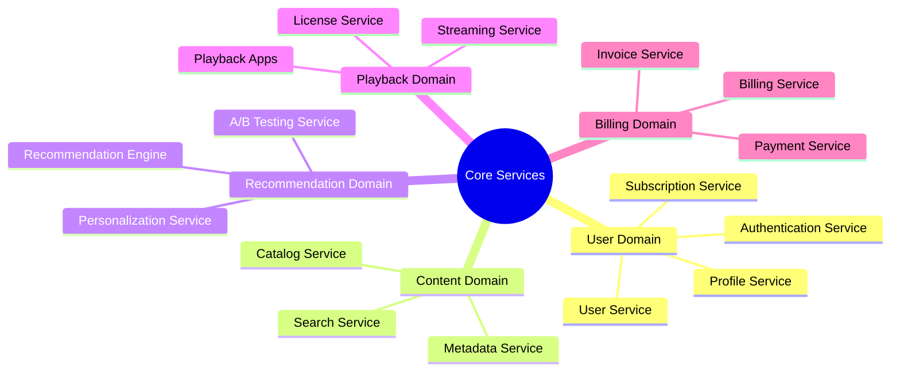
```mermaid
mindmap
    root((Core Services))
        User Domain
            User Service
            Profile Service
            Authentication Service
            Subscription Service
        Content Domain
            Catalog Service
            Metadata Service
            Search Service
        Recommendation Domain
            Recommendation Engine
            Personalization Service
            A/B Testing Service
        Playback Domain
            Playback Apps
            Streaming Service
            License Service
        Billing Domain
            Billing Service
            Payment Service
            Invoice Service
```

### 5.3. Chi Tiết Các Services

#### 5.3.1. User Service

| Aspect | Details |
|--------|---------|
| **Responsibility** | Quản lý user accounts, profiles, preferences |
| **Database** | Cassandra (high availability) |
| **API Style** | REST + gRPC |
| **Scale** | 200M+ users globally |

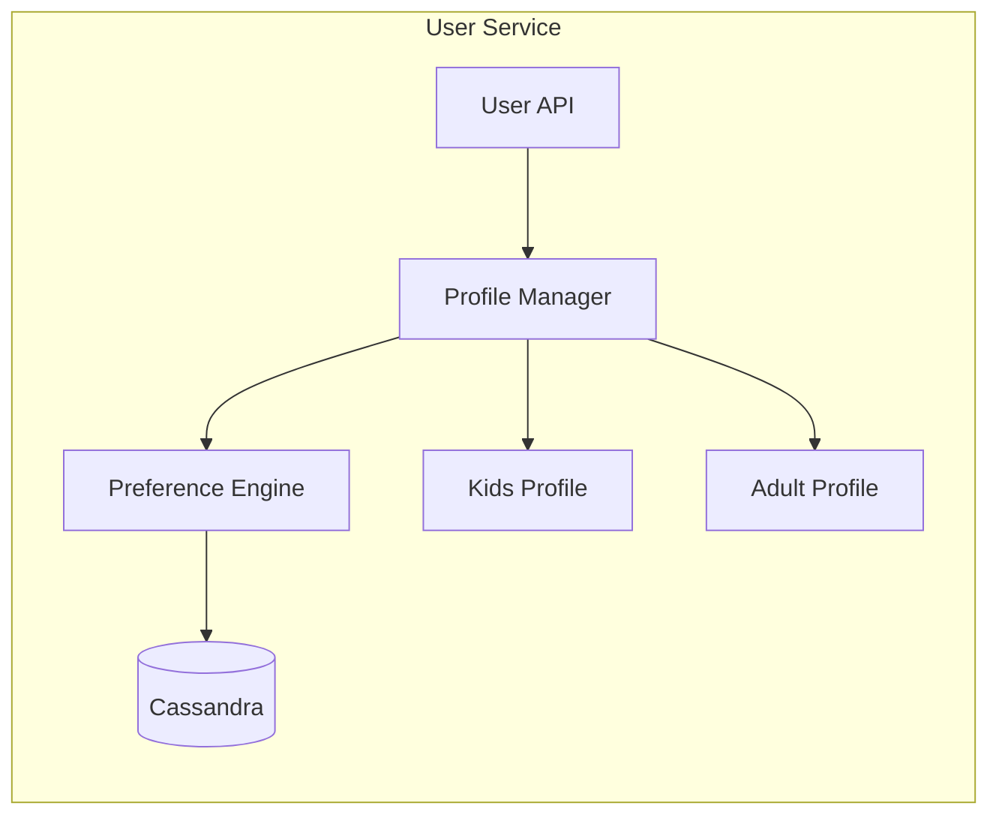
```mermaid
graph LR
    subgraph "User Service"
        A[User API] --> B[Profile Manager]
        B --> C[Preference Engine]
        C --> D[(Cassandra)]
        
        B --> E[Kids Profile]
        B --> F[Adult Profile]
    end
```

#### 5.3.2. Catalog Service

| Aspect | Details |
|--------|---------|
| **Responsibility** | Quản lý metadata của movies và TV shows |
| **Database** | Cassandra + EVCache |
| **Caching** | Multi-tier caching strategy |
| **Updates** | Near real-time sync |

#### 5.3.3. Recommendation Service

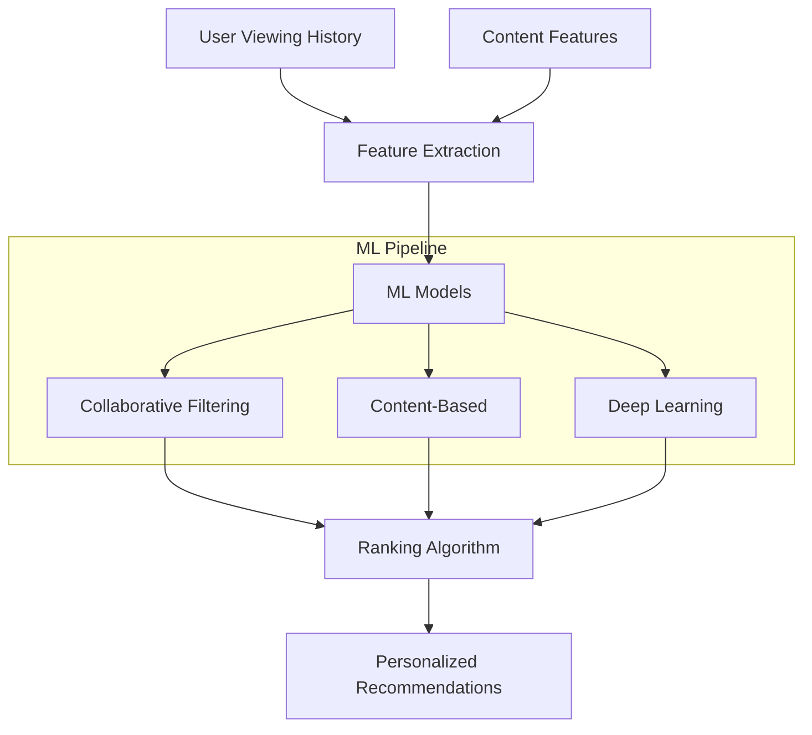
```mermaid
flowchart TD
    A[User Viewing History] --> B[Feature Extraction]
    C[Content Features] --> B
    B --> D[ML Models]
    
    subgraph "ML Pipeline"
        D --> E[Collaborative Filtering]
        D --> F[Content-Based]
        D --> G[Deep Learning]
    end
    
    E & F & G --> H[Ranking Algorithm]
    H --> I[Personalized Recommendations]
```

| Model Type | Description |
|------------|-------------|
| **Collaborative Filtering** | Recommendations based on similar users |
| **Content-Based** | Recommendations based on content similarity |
| **Deep Learning** | Neural networks for complex patterns |
| **Contextual Bandits** | Real-time optimization |

#### 5.3.4. Playback Apps

Playback Apps là service quan trọng nhất trong việc streaming video:

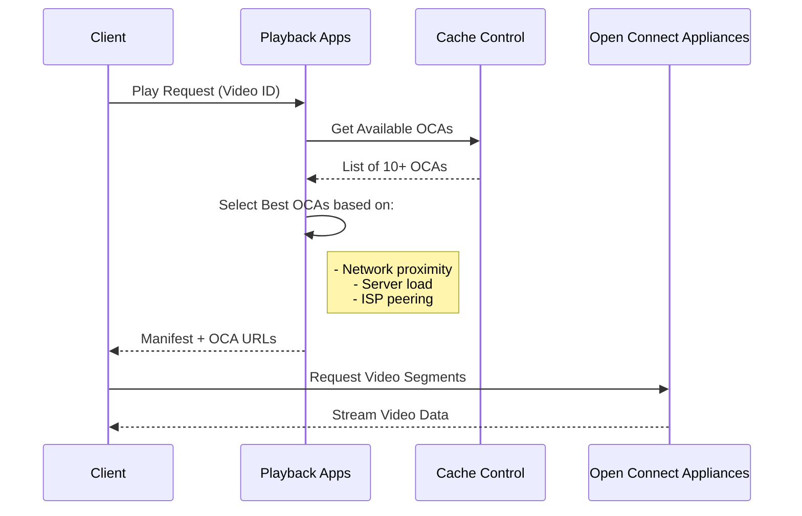
```mermaid
sequenceDiagram
    participant C as Client
    participant PA as Playback Apps
    participant CC as Cache Control
    participant OCA as Open Connect Appliances
    
    C->>PA: Play Request (Video ID)
    PA->>CC: Get Available OCAs
    CC-->>PA: List of 10+ OCAs
    PA->>PA: Select Best OCAs based on:
    Note right of PA: - Network proximity<br/>- Server load<br/>- ISP peering
    PA-->>C: Manifest + OCA URLs
    C->>OCA: Request Video Segments
    OCA-->>C: Stream Video Data
```

#### 5.3.5. Billing Service

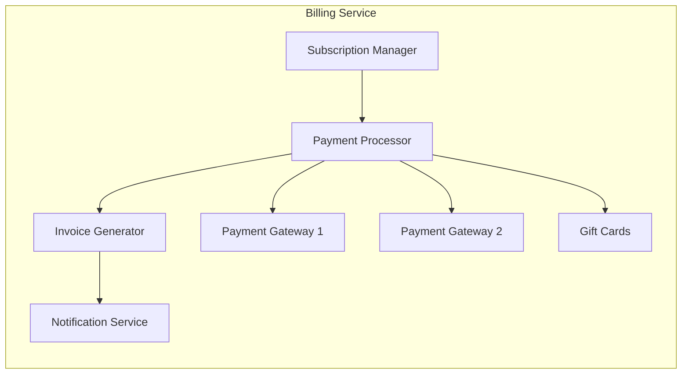
```mermaid
flowchart LR
    subgraph "Billing Service"
        A[Subscription Manager] --> B[Payment Processor]
        B --> C[Invoice Generator]
        C --> D[Notification Service]
        
        B --> E[Payment Gateway 1]
        B --> F[Payment Gateway 2]
        B --> G[Gift Cards]
    end
```

### 5.4. Inter-Service Communication

Netflix sử dụng cả synchronous và asynchronous communication:

| Pattern | Technology | Use Case |
|---------|------------|----------|
| **Sync REST** | Spring Boot RestTemplate | Simple queries |
| **Sync gRPC** | gRPC | High-performance internal calls |
| **Async Events** | Apache Kafka | Event-driven updates |
| **GraphQL** | Apollo Federation | API aggregation |

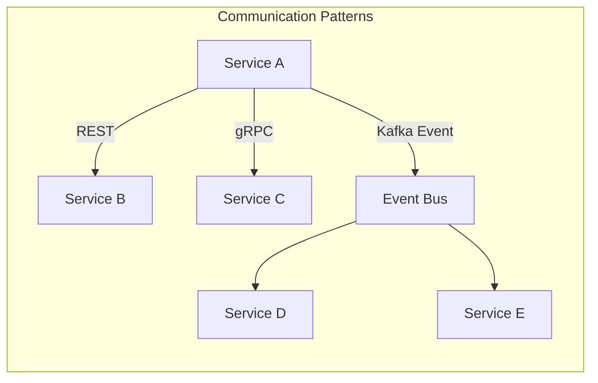
```mermaid
graph LR
    subgraph "Communication Patterns"
        A[Service A] -->|REST| B[Service B]
        A -->|gRPC| C[Service C]
        A -->|Kafka Event| D[Event Bus]
        D --> E[Service D]
        D --> F[Service E]
    end
```

---

## 6. Layer 5: Data Layer

### 6.1. Tổng Quan

Netflix sử dụng **Database per Service** pattern với nhiều loại databases khác nhau theo use case.

### 6.2. Database Technologies

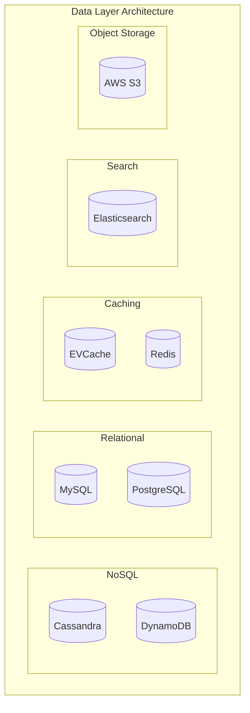
```mermaid
graph TB
    subgraph "Data Layer Architecture"
        subgraph "NoSQL"
            C[(Cassandra)]
            D[(DynamoDB)]
        end
        
        subgraph "Relational"
            M[(MySQL)]
            P[(PostgreSQL)]
        end
        
        subgraph "Caching"
            E[(EVCache)]
            R[(Redis)]
        end
        
        subgraph "Search"
            ES[(Elasticsearch)]
        end
        
        subgraph "Object Storage"
            S3[(AWS S3)]
        end
    end
```

### 6.3. Chi Tiết Từng Database

#### 6.3.1. Apache Cassandra

| Aspect | Details |
|--------|---------|
| **Use Cases** | User profiles, viewing history, recommendations |
| **Scale** | Petabytes of data |
| **Nodes** | 500+ nodes globally |
| **Consistency** | Tunable (ONE to QUORUM) |

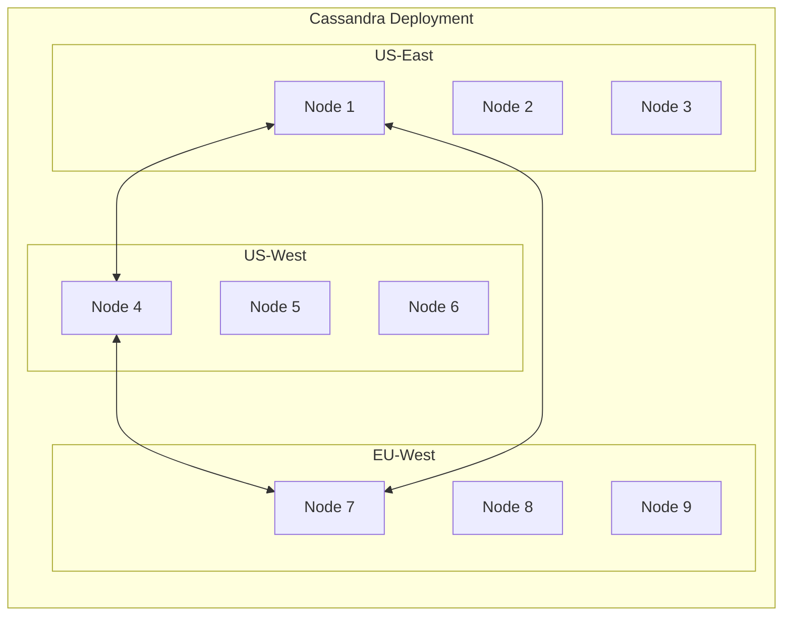
```mermaid
graph LR
    subgraph "Cassandra Deployment"
        subgraph "US-East"
            N1[Node 1]
            N2[Node 2]
            N3[Node 3]
        end
        
        subgraph "US-West"
            N4[Node 4]
            N5[Node 5]
            N6[Node 6]
        end
        
        subgraph "EU-West"
            N7[Node 7]
            N8[Node 8]
            N9[Node 9]
        end
    end
    
    N1 <--> N4
    N4 <--> N7
    N1 <--> N7
```

**Best Practices:**
- **Denormalization:** Optimize for read patterns
- **Time-series data:** Use proper partition keys
- **Compaction:** Regular maintenance for performance

#### 6.3.2. EVCache (Memcached-based)

Netflix's distributed caching solution built on Memcached:

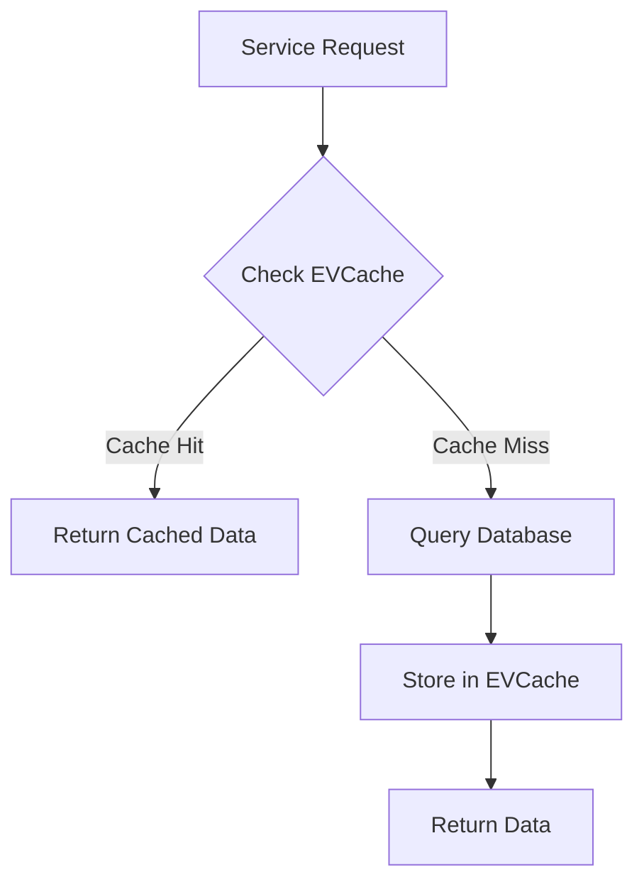
```mermaid
flowchart TD
    A[Service Request] --> B{Check EVCache}
    B -->|Cache Hit| C[Return Cached Data]
    B -->|Cache Miss| D[Query Database]
    D --> E[Store in EVCache]
    E --> F[Return Data]
```

| Feature | Description |
|---------|-------------|
| **Zone Awareness** | Cache replicas across availability zones |
| **Auto-discovery** | Automatic cluster membership |
| **TTL Management** | Configurable expiration policies |
| **Replication** | Cross-region replication |

#### 6.3.3. AWS DynamoDB

| Use Case | Description |
|----------|-------------|
| **Session Storage** | User session management |
| **A/B Testing** | Experiment configurations |
| **Feature Flags** | Dynamic feature toggles |

#### 6.3.4. AWS S3

| Content Type | Purpose |
|--------------|---------|
| **Video Masters** | Original video files |
| **Encoded Videos** | Transcoded video segments |
| **Thumbnails** | Preview images |
| **Subtitles** | Multi-language captions |

### 6.4. Data Consistency Patterns

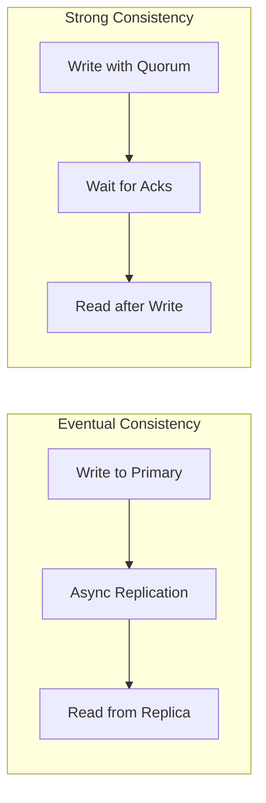
```mermaid
flowchart LR
    subgraph "Eventual Consistency"
        A[Write to Primary] --> B[Async Replication]
        B --> C[Read from Replica]
    end
    
    subgraph "Strong Consistency"
        D[Write with Quorum] --> E[Wait for Acks]
        E --> F[Read after Write]
    end
```

> [!IMPORTANT]
> Netflix chấp nhận **Eventual Consistency** cho hầu hết các use cases để đạt được high availability và low latency.

---

## 7. Layer 6: Content Delivery Network (CDN) Layer

### 7.1. Open Connect - Netflix's CDN

#### 7.1.1. Tổng Quan

Open Connect là CDN tự xây dựng của Netflix, phục vụ hơn **100% traffic streaming** của Netflix.

| Metric | Value |
|--------|-------|
| **Số lượng OCAs** | 18,000+ servers |
| **Locations** | 190+ countries |
| **ISP Partners** | 1,000+ ISPs |
| **Traffic** | 100+ Tbps peak |

#### 7.1.2. Kiến Trúc Open Connect

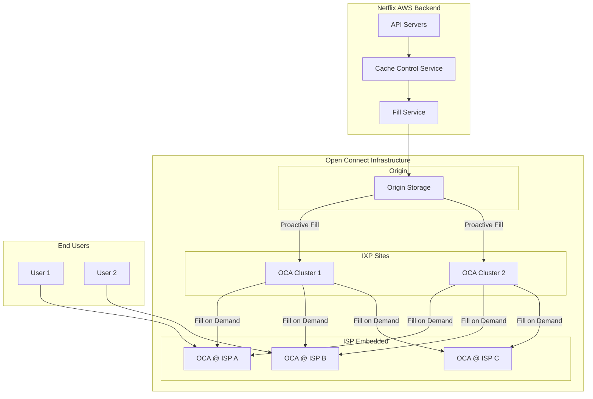
```mermaid
flowchart TB
    subgraph "Netflix AWS Backend"
        API[API Servers]
        CC[Cache Control Service]
        Fill[Fill Service]
    end
    
    subgraph "Open Connect Infrastructure"
        subgraph "Origin"
            Origin1[Origin Storage]
        end
        
        subgraph "IXP Sites"
            IXP1[OCA Cluster 1]
            IXP2[OCA Cluster 2]
        end
        
        subgraph "ISP Embedded"
            ISP1[OCA @ ISP A]
            ISP2[OCA @ ISP B]
            ISP3[OCA @ ISP C]
        end
    end
    
    subgraph "End Users"
        U1[User 1]
        U2[User 2]
    end
    
    API --> CC
    CC --> Fill
    Fill --> Origin1
    Origin1 -->|Proactive Fill| IXP1 & IXP2
    IXP1 & IXP2 -->|Fill on Demand| ISP1 & ISP2 & ISP3
    U1 --> ISP1
    U2 --> ISP2
```

#### 7.1.3. Open Connect Appliances (OCAs)

| OCA Type | Capacity | Location |
|----------|----------|----------|
| **OCA v2** | 100 TB SSD | ISP embedded |
| **OCA v3** | 200 TB SSD | IXP sites |
| **OCA Flash** | 500 TB NVMe | High-traffic locations |

```mermaid
graph LR
    subgraph "OCA Hardware"
        A[Network Interface 100GbE] --> B[Load Balancer]
        B --> C[nginx + Custom Stack]
        C --> D[SSD Storage Pool]
        D --> E1[SSD 1]
        D --> E2[SSD 2]
        D --> E3[SSD N]
    end
```

### 7.2. Content Delivery Strategy

#### 7.2.1. Proactive Caching

```mermaid
sequenceDiagram
    participant ML as Prediction ML
    participant CC as Cache Control
    participant Origin as Origin
    participant OCA as OCAs
    
    ML->>CC: Predict popular content
    CC->>Origin: Request content fill
    Origin->>OCA: Push content to OCAs
    Note over OCA: Content ready before demand
```

- **Popularity Prediction:** ML models predict which content will be popular
- **Pre-positioning:** Content placed on OCAs before peak demand
- **Geographic Optimization:** Place content near target audience

#### 7.2.2. Tiered Caching

```mermaid
flowchart TD
    A[User Request] --> B{ISP OCA Cache?}
    B -->|Hit| C[Serve from ISP OCA]
    B -->|Miss| D{IXP OCA Cache?}
    D -->|Hit| E[Serve from IXP OCA]
    D -->|Miss| F{Origin?}
    F --> G[Serve from Origin + Fill OCAs]
```

### 7.3. Adaptive Streaming

Netflix sử dụng **Dynamic Adaptive Streaming over HTTP (DASH)**:

```mermaid
flowchart LR
    subgraph "Adaptive Bitrate"
        A[Video File] --> B[Encoder Pipeline]
        B --> C1[1080p - 5.8 Mbps]
        B --> C2[720p - 2.4 Mbps]
        B --> C3[480p - 1.0 Mbps]
        B --> C4[360p - 0.5 Mbps]
        
        C1 & C2 & C3 & C4 --> D[MPD Manifest]
    end
```

| Quality | Resolution | Bitrate |
|---------|------------|---------|
| **UHD 4K** | 3840x2160 | 15-25 Mbps |
| **Full HD** | 1920x1080 | 5-8 Mbps |
| **HD** | 1280x720 | 2-4 Mbps |
| **SD** | 720x480 | 1-2 Mbps |
| **Low** | 426x240 | 0.3-0.5 Mbps |

---

## 8. Layer 7: Infrastructure & Observability Layer

### 8.1. AWS Infrastructure

Netflix là một trong những khách hàng lớn nhất của AWS:

```mermaid
graph TB
    subgraph "AWS Infrastructure"
        subgraph "Compute"
            EC2[EC2 Instances]
            Titus[Titus Container Platform]
        end
        
        subgraph "Storage"
            S3[S3 Object Storage]
            EBS[EBS Block Storage]
        end
        
        subgraph "Network"
            VPC[VPC]
            ELB[Elastic Load Balancer]
            DirectConnect[Direct Connect]
        end
        
        subgraph "Data Services"
            DynamoDB[(DynamoDB)]
            ElastiCache[(ElastiCache)]
            RDS[(RDS)]
        end
    end
```

### 8.2. Titus - Container Orchestration

Titus là container orchestration platform tự phát triển của Netflix:

```mermaid
flowchart TD
    subgraph "Titus Architecture"
        A[Titus API] --> B[Titus Master]
        B --> C[Scheduler]
        C --> D[Agent Pool]
        D --> E1[Agent 1]
        D --> E2[Agent 2]
        D --> E3[Agent N]
        E1 & E2 & E3 --> F[Docker Containers]
    end
```

| Feature | Description |
|---------|-------------|
| **Multi-tenant** | Shared infrastructure across teams |
| **Batch & Service** | Support both batch jobs and long-running services |
| **Auto-scaling** | Automatic capacity management |
| **AWS Integration** | Deep integration with AWS services |

### 8.3. Spinnaker - Continuous Delivery

```mermaid
flowchart LR
    A[Code Commit] --> B[Build/Test]
    B --> C[Spinnaker]
    
    subgraph "Spinnaker Pipeline"
        C --> D[Bake AMI]
        D --> E[Deploy to Test]
        E --> F[Integration Tests]
        F --> G[Deploy to Prod - Canary]
        G --> H[Gradual Rollout]
        H --> I[Full Production]
    end
```

### 8.4. Observability Stack

#### 8.4.1. Atlas - Metrics

```mermaid
flowchart TD
    subgraph "Atlas Architecture"
        S1[Service 1] -->|metrics| C[Atlas Collector]
        S2[Service 2] -->|metrics| C
        S3[Service 3] -->|metrics| C
        C --> A[(Atlas Storage)]
        A --> D[Dashboards]
        A --> AL[Alerting]
    end
```

#### 8.4.2. Full Observability Stack

| Component | Tool | Purpose |
|-----------|------|---------|
| **Metrics** | Atlas | Time-series metrics collection |
| **Logging** | Mantis | Real-time log streaming |
| **Tracing** | Custom solution | Distributed tracing |
| **Alerting** | PagerDuty + Internal | On-call alerts |

### 8.5. Chaos Engineering

Netflix pioneered Chaos Engineering với bộ công cụ "Simian Army":

```mermaid
mindmap
    root((Simian Army))
        Chaos Monkey
            Kill random instances
            Test instance resilience
        Latency Monkey
            Inject network delays
            Test timeout handling
        Chaos Gorilla
            Kill entire AZ
            Test zone resilience
        Chaos Kong
            Simulate region failure
            Test cross-region failover
        Conformity Monkey
            Check compliance
            Enforce standards
```

> [!CAUTION]
> Chaos Engineering nên được thực hiện cẩn thận với proper safeguards và chỉ trong môi trường đã chuẩn bị kỹ lưỡng.

---

## 9. Luồng Dữ Liệu Giữa Các Layers

### 9.1. Video Playback Flow

```mermaid
sequenceDiagram
    participant User as User Device
    participant Zuul as Zuul Gateway
    participant Auth as Auth Service
    participant Eureka as Eureka
    participant Playback as Playback Apps
    participant OCA as OCA (CDN)
    
    User->>Zuul: Play Video Request
    Zuul->>Auth: Validate Token
    Auth-->>Zuul: Token Valid
    Zuul->>Eureka: Discover Playback Service
    Eureka-->>Zuul: Service Instances
    Zuul->>Playback: Forward Play Request
    
    Playback->>Playback: Get User License
    Playback->>Playback: Select Best OCAs
    Playback-->>User: Video Manifest + OCA URLs
    
    loop Stream Video
        User->>OCA: Request Video Chunk
        OCA-->>User: Video Data
    end
```

### 9.2. Recommendation Flow

```mermaid
sequenceDiagram
    participant User as User Device
    participant API as API Gateway
    participant Rec as Recommendation Service
    participant Cache as EVCache
    participant Cassandra as Cassandra
    
    User->>API: Get Home Page
    API->>Rec: Get Personalized Rows
    
    Rec->>Cache: Check Cache
    alt Cache Hit
        Cache-->>Rec: Cached Recommendations
    else Cache Miss
        Rec->>Cassandra: Get User History
        Cassandra-->>Rec: Viewing History
        Rec->>Rec: Run ML Models
        Rec->>Cache: Store Results
    end
    
    Rec-->>API: Personalized Content
    API-->>User: Rendered Page
```

---

## 10. Tổng Kết

### 10.1. Điểm Mạnh Của Kiến Trúc Netflix

| Aspect | Benefit |
|--------|---------|
| **Scalability** | Xử lý 200M+ subscribers, 15B+ API calls/ngày |
| **Resilience** | Chaos Engineering đảm bảo system luôn hoạt động |
| **Performance** | Open Connect CDN giảm latency tối đa |
| **Agility** | 700+ independent services, deploy hàng nghìn lần/tuần |

### 10.2. Lessons Learned

> [!TIP]
> **Key Takeaways từ Netflix Architecture:**
> 1. **Own your CDN:** Tự xây dựng CDN nếu streaming là core business
> 2. **Embrace failure:** Design for failure, không tránh né failures
> 3. **Event-driven:** Sử dụng async communication cho loose coupling
> 4. **Open source:** Share và contribute để improve the ecosystem

### 10.3. Công Nghệ Netflix Open Source

```mermaid
mindmap
    root((Netflix OSS))
        API Gateway
            Zuul
        Service Discovery
            Eureka
        Resilience
            Hystrix
            Resilience4j
        Client Load Balancing
            Ribbon
        Deployment
            Spinnaker
        Container
            Titus
        Monitoring
            Atlas
        Data
            EVCache
            Dynomite
```

---

## Tài Liệu Tham Khảo

- [Netflix Tech Blog](https://netflixtechblog.com/)
- [Netflix OSS GitHub](https://github.com/Netflix)
- [Open Connect Program](https://openconnect.netflix.com/)
- microservices_architecture_analysis.md (tài liệu gốc)

---

> **Ghi chú:** Tài liệu này được tổng hợp từ nhiều nguồn công khai và blog kỹ thuật của Netflix. Một số chi tiết có thể đã thay đổi do Netflix liên tục cải tiến hệ thống.
